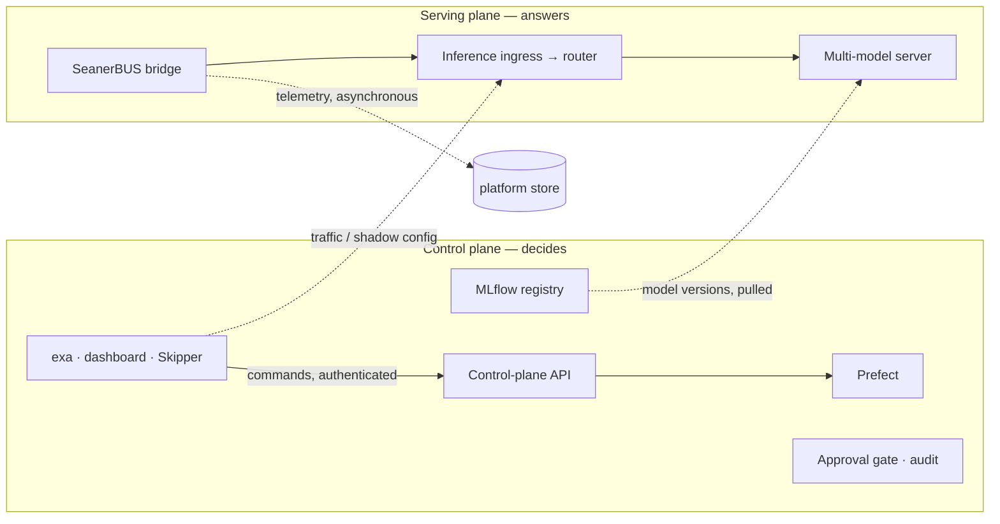

# Control plane and serving plane

ExaMLOps has two planes with different jobs and different availability needs.

- The **control plane** decides: which model version serves, when to retrain, who approved what.
  It is the control-plane API and its workers, the MLflow registry, the Prefect orchestrator, the
  approval gate, policy, and everything operators use to change the platform: the `exa` CLI, the
  dashboard and the Skipper agent.
- The **serving plane** answers requests: the SeanerBUS bridge, the Ray Serve inference ingress,
  feature transformer and router, and the multi-model server.

!!! note "Why *serving* plane"
    Distributed-systems writing calls the request path the *data plane*. In ExaMLOps,
    **dataplane** names something else: the data-integration layer that brings external sources
    into versioned training snapshots. This page says *serving plane* so the two never blur.

## The boundary

Solid arrows are synchronous calls. Dashed arrows cross the boundary: configuration flows *into*
the serving plane, and telemetry flows *out*. Neither is ever awaited on the request path.

## Rules the serving plane follows

| Rule | What it means | Status |
|---|---|---|
| **Reply first** | The bridge answers the bus before it records drift and input statistics. A slow or unavailable datastore cannot delay or fail an inference. Records wait in a bounded spool; overflow and write failures are counted and alerted. | Enforced |
| **Decisions, not requests, are audited** | The hash-chained audit log records decisions (approve, reject, retrain, traffic change). Per-request volume is a metric (`seanerbus_inferences_total`), not an audit row. | Enforced |
| **Last-known-good** | A replica that cannot reach MLflow keeps serving the models it has; a failed reload never evicts a healthy model. | Enforced |
| **Admin actions are control actions** | Reload and live traffic-rule changes need `RAY_SERVE_ADMIN_TOKEN`; inference routes stay open to clients. | Enforced |
| **Serving gateway** | Envoy fronts inference: a credential on every request (virtual key or IdP token, decided by `examlops.serving_gateway`), per-tenant quotas across replicas, the verified tenant passed upstream, body and time limits, a retry budget. Only inference is routed. | Implemented; opt-in Compose profile `gateway` ([guide](../guides/serving-gateway.md)) |
| **Verify before load** | Versions are signed with Ed25519 at registration; the serving snapshot carries each signature; replicas verify with public keys only. With `EXAMLOPS_SERVING_VERIFY=enforce`, serving refuses an unsigned, tampered or untrusted artifact and loads exactly the bytes it verified. | Implemented; `warn` by default (checked and audited, not refused) until an operator enforces |
| **No synchronous control-plane dependency** | Serving never calls the control plane, the platform store, MLflow or Prefect *on the request path*. | Enforced when a serving snapshot is in force: alias versions, shadow targets and traffic splits all come from it. Without one, the legacy path reads the store through a 30 s cache that fails open. |
| **Configuration arrives as a versioned snapshot** | Desired state reaches replicas with a generation number, and each replica reports the generation it applied. | Enforced for alias versions, shadow targets and traffic splits ([serving snapshot](../guides/serving-snapshot.md), ADR 0127): the control plane compiles it once, replicas report `ray_examlops_serving_snapshot_applied_generation`, and `ServingSnapshotLagging` fires on a gap |
| **Restart from local state** | A replica starting with the control plane, the database, the broker and MLflow all down serves what it served before. | Enforced and tested (`tests/unit/test_serving_static_stability.py`): the last-known-good snapshot (`RAY_SNAPSHOT_CACHE`) says what to serve, the content-addressed artifact cache (`RAY_ARTIFACT_CACHE`) holds the bytes |

The target is **static stability**: with the entire control plane down, running replicas keep
serving, and a restarted replica serves from its last-known-good local state. ADR 0123 records the
decision.

## Rules the control plane follows

| Rule | What it means |
|---|---|
| **One dispatch target** | Every retrain goes to one Prefect deployment (`training_flow/examlops-dispatch`). `GET /health` reports whether it exists and accepts what the control plane sends. |
| **Admission never wedges** | A dispatch refused at capacity answers 429 with `Retry-After` and leaves nothing queued; a crashed dispatch releases its slot when its lease expires. |
| **Governed decisions** | The requester of a change cannot approve it, and every gate decision is audited in the same transaction as the decision. |
| **Commands do not wait on their executor** | `POST /v1/retrain` records the command and answers 202; a worker pool dispatches it with retries, backoff and a bounded attempt count. The synchronous routes remain for existing clients. |
| **One lock per invariant** | On Postgres each write domain (audit chain, outbox, admission, approvals, coordination, ModelZoo events) takes its own advisory lock instead of one cluster-wide lock, so unrelated writes no longer queue behind each other. |
| **Idempotent inputs** | Retrains carry an idempotency key end to end; webhook redeliveries are recognised by commit and do nothing twice. |
| **Changes are published, not polled** | Every state change enqueues a CloudEvent in the same transaction; a relay publishes it to NATS JetStream, where durable consumers subscribe ([event backbone](../guides/event-backbone.md)). |
| **Consumers match the contract** | Every CLI, dashboard and agent call to the control plane is checked against its committed API contract, including whether it sends a credential. |

## Security posture of each hop

| Hop | Protocol | Authentication today | Planned |
|---|---|---|---|
| CLI / dashboard / agent → control plane | HTTP/JSON | Bearer credential (structured per principal, or the shared legacy token); federated sign-in for people | Workload identity for services (ADR 0125) |
| Dashboard → control plane (images in the browser) | HTTP | Short-lived signed dashboard URL; the credential stays server-side | — |
| Operators → Ray Serve admin routes | HTTP/JSON | `RAY_SERVE_ADMIN_TOKEN`, closed when unset | Replaced by the serving snapshot |
| Clients → inference | HTTP/JSON, Cap'n Proto on the bus | Network position only | Gateway with per-tenant authentication and quotas (ADR 0126) |
| Serving → artifact store | S3 over HTTP | Read-only serving credential when configured | Dynamic credentials |
| Agent | HTTP | `AGENT_API_KEY`; an agent reachable beyond loopback refuses every request until one is set | Workload identity (ADR 0125) |
| Ray dashboard | HTTP | Loopback only (its Jobs API runs code) | — |

## Related

- [Control plane guide](../guides/control-plane.md) — endpoints, dispatch target, admission,
  separation of duties, audit
- [Ray Serve](../components/ray-serve.md) — admin routes, traffic splits, verify-before-load
- [SeanerBUS bridge](../guides/seanerbus.md) — reply-first telemetry
- [Environment variables](../reference/env-vars.md)
