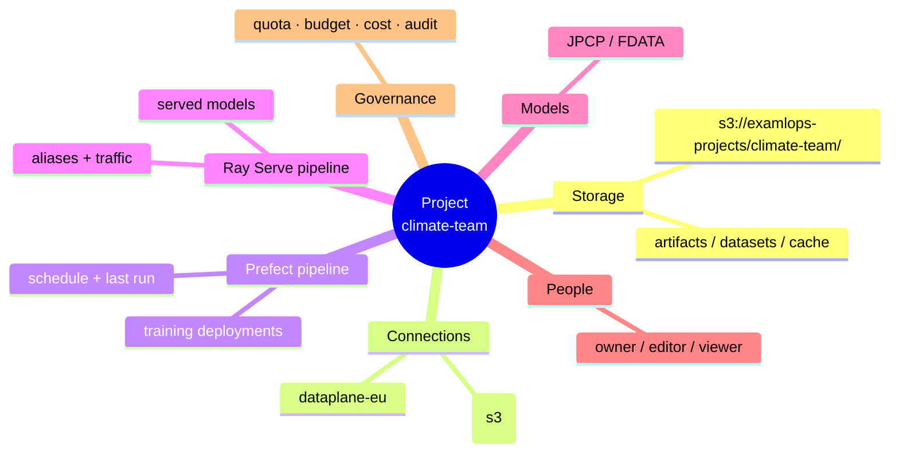
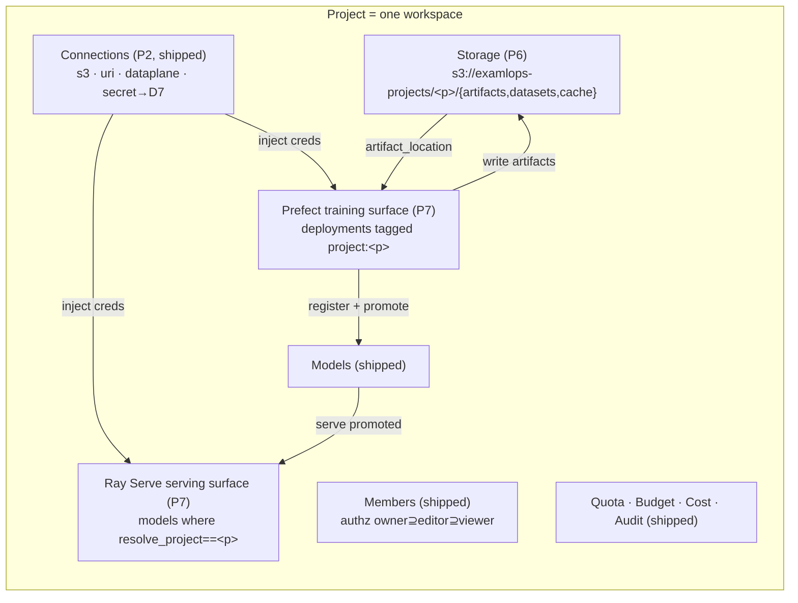
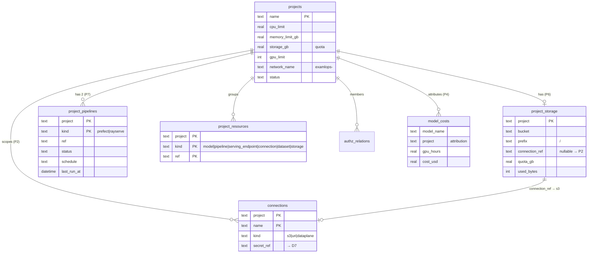
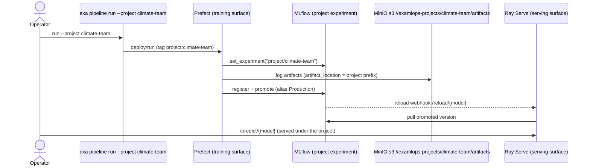

# Architecture — The ExaMLOps Project Workspace

> **Status.** This document describes the ExaMLOps Project as a unified workspace. Increment 1
> (the project primitive, Named Connections, project cost — ADRs 0086–0090) and the **Project Anatomy**
> layer described here (per-project storage, the two pipeline surfaces, the assembled view —
> ADRs 0091–0093) are both **shipped**.

## 1. What a Project is

A **Project** is ExaMLOps's single canonical **workspace** — the unit that owns a team's data storage,
its data connections, its training pipeline, its serving pipeline, its models, its people, its quota,
and its cost, so a team's ML footprint is **isolated, attributable, and governable as one thing**.

It is a self-contained *data-science workspace*, delivered on a
**Docker + SQLite (`platform.db`) + MinIO** substrate that needs no Kubernetes.



## 2. C4 — System context

```mermaid
flowchart TB
    operator([Operator / research team])
    subgraph exa["exa CLI + Dashboard"]
      cli[exa project]
      dash[Projects console]
    end
    subgraph platform["ExaMLOps platform"]
      db[(platform.db<br/>projects · resources · storage · pipelines · connections · authz · costs)]
      minio[(MinIO<br/>s3://examlops-projects/&lt;p&gt;/)]
      mlflow[MLflow registry]
      prefect[Prefect<br/>training deployments]
      ray[Ray Serve<br/>MultiModelServer]
      d7[D7 secrets]
    end
    operator --> cli --> db
    operator --> dash --> db
    cli --> minio
    prefect -->|artifacts| minio
    prefect --> mlflow
    ray -->|pull model| mlflow
    db -.connection_ref.-> d7
    prefect -.project tag.-> db
    ray -.ModelInfo.project.-> db
```

A Project ties together five running subsystems — **MinIO** (storage), **D7 secrets** (connection
credentials), **Prefect** (training), **MLflow** (registry/artifacts), and **Ray Serve** (serving) —
through one key in `platform.db`.

## 3. C4 — Container view (the anatomy)



**The loop:** connections feed the pipelines; the **Prefect** surface trains and writes artifacts into
the project **Storage** (via a per-project MLflow experiment), registers + promotes **Models**; the
**Ray Serve** surface serves those promoted models. Everything is scoped to the one project key.

## 4. C4 — Component / data model



`project_storage` and `project_pipelines` are the **two new additive tables** (ADR 0091/0092);
everything else is shipped (ADR 0086–0089). No table is modified destructively — the pattern is
`CREATE TABLE IF NOT EXISTS` + additive columns, per ADR 0086.

## 5. Train → serve sequence (through project storage)



The training run's artifacts land in the **project's own prefix**; promotion notifies the project's
serving surface, which pulls and serves — the whole lifecycle inside one workspace boundary.

## 6. Isolation & multi-tenancy model

A project is a **governable boundary**. On the Docker/MinIO/SQLite substrate the enforcement depth is
honest — some boundaries are advisory, some are checked, none require Kubernetes:

| Boundary | ExaMLOps mechanism | Enforcement |
|---|---|---|
| **Network** | `projects.network_name = examlops-<name>` (per-project docker bridge) | advisory (compose) |
| **Storage** | per-project MinIO prefix *(P6, shipped)* | soft (shared bucket; hard via `connection_ref` → dedicated bucket) |
| **Connections** | `connections` PK `(project, name)`; credentials in D7 secrets | scoped record, secret-safe |
| **People / RBAC** | `authz_relations` owner⊇editor⊇viewer on `project:<name>` | checked in `examlops.authz` (default-deny, `EXAMLOPS_MULTITENANCY`) |
| **Compute quota** | `projects` cpu/mem/gpu/storage limits; `exa project compose` | advisory (compose) |
| **Cost** | `model_costs.project` *(P4, shipped)* | attributed |
| **Audit** | `audit_events` with project as target | recorded |

**Hard enforcement** (kernel-level network firewalling, per-bucket IAM, cluster-level queue admission)
is **out of scope** for the Anatomy increment — deferred to a future live-runtime increment. The value
delivered now is making the boundary **named, visible, and consistent** across CLI and dashboard.

## 7. Surfaces — CLI ↔ Dashboard parity

| Concern | CLI | Dashboard (read) | Dashboard (write — Phase 42) |
|---|---|---|---|
| List all projects | `exa project list` | Projects console (grid) | — |
| Full anatomy (one pane) | `exa project show <name>` | Project detail (Storage · Connections · Pipelines · Models · Members · Quota · Budget) | — |
| Create / delete project | `exa project create` / *(CLI)* | — | Create modal · Danger-zone **Delete project** |
| Storage *(P6)* | `exa project storage <name>` | Storage panel | **Provision** + **Bind connection** |
| Pipelines *(P7)* | `exa project pipelines <name>` | Prefect + Ray Serve panels | — |
| Connections *(P2)* | `exa connection create/test/delete` | Connections panel (secret-safe) | **New** · **Test** · **Delete** |
| Members | `exa project add-member / remove-member` | Members panel | **Add** · **Remove** |

Both surfaces read the **same** `get_project_full()` model — the CLI and dashboard say the exact same
words, by construction. Since Phase 42 the *write* side is shared too: the dashboard's mutating routers
call the **same `examlops.*` functions** the CLI calls (`examlops.connections.*`,
`ensure_project_storage`/`bind_project_connection`) rather than raw-sqlite mirrors, so there is one
implementation of each mutation and a secret entered in the dashboard is written through
`examlops.secrets` — the identical, CLI/serving-readable store. Enforcement stays at the dashboard BFF
(F15): viewers are read-only (403 + `deny_reason`), admins hold the `project.manage` / `connection.manage`
capabilities, and every mutation is audited as a `dashboard`-sourced event. No secret value ever leaves
the server — the browser sees only `hasSecret`.

## 8. Maturity & what's next

| Layer | Status | ADR |
|---|---|---|
| Project primitive · membership · cost · connections · workbenches | **shipped** (Increment 1) | 0086–0090 |
| Per-project storage (prefix + MLflow experiment binding) | **shipped** (Increment 2) | 0091 (P6) |
| Two pipeline surfaces (Prefect + Ray Serve) | **shipped** (Increment 2) | 0092 (P7) |
| Assembled anatomy view (CLI + dashboard) + isolation model | **shipped** (Increment 2) | 0093 (P8) |
| Dashboard edit parity (connections/projects/storage writes via shared `examlops.*` paths) | **shipped** (Phase 42) | — |
| Enforced isolation (network firewalling · per-bucket IAM · cluster queue admission) | **future** | — |

Design set: dossier `design/vision/library/soa-project-anatomy.md`, Vision Card
`design/vision/ideas/2026-07-16-project-anatomy.md`, ADRs 0091–0093, specs P6–P8, plan
`internal design notes`.

## Related

- [Projects & Workspaces guide](../guides/projects-workspaces.md) — the shipped Increment-1 surface.
- ADR 0086 (Unified Project Workspace), 0087 (Named Connections), 0088 (project-scoped serving &
  pipelines), 0089 (project FinOps), 0090 (Workbenches), 0091–0093 (this increment).
