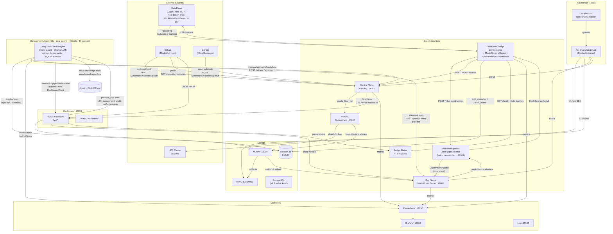
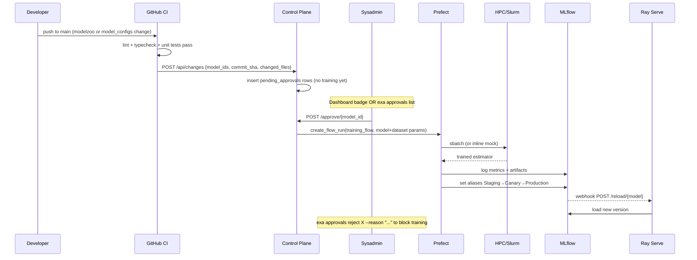

# System Architecture

ExaMLOps is a self-contained MLOps platform wiring together open-source tools (Prefect, MLflow, MinIO, Ray Serve, Prometheus, Grafana, Loki) and a custom model library. It supports three pluggable data sources, multi-stage MLflow lifecycles, version-selectable inference, client-driven retraining, three ML frameworks (sklearn, PyTorch, HuggingFace), and a ModelZoo freshness tracking loop that marks models stale on every repository push and surfaces freshness state in the dashboard and `exa` CLI.

## Repository Structure

The source tree is organized into four top-level areas with clear ownership boundaries. This is a **source-code/packaging** organization — the runtime topology below (services, ports, data flow) is independent of it.

```
ai-productions/
├── platform/        # Infra & operations
│   ├── cli/         # the `examlops` package + `exa` CLI  (src/examlops/)
│   ├── services/    # dashboard · control_plane · agent  (containerized apps)
│   ├── clients/     # simulators + DataPlane bridge
│   ├── infra/       # docker-compose + slurm-adapter
│   └── ci/          # notify_model_changes.py
├── pipelines/       # Prefect training & model-lifecycle orchestration
├── serving/         # ray_serving (MultiModelServer) + inference_pipeline
└── modelzoo/        # upstream model library (read-only)
```

The three library areas — `platform/cli` (`examlops`), `pipelines` (`examlops-pipelines`), `serving` (`examlops-serving`) — are members of a `[tool.uv.workspace]` declared in the root `pyproject.toml` (renamed `examlops-workspace`; it carries only the workspace + shared ruff/mypy/pytest config). The application services keep their own `requirements.txt`/Dockerfiles and install the library packages they depend on at container-build time. `modelzoo/` remains an external poetry package, consumed but never edited.

## Component Diagram



## Inference Request Flow

DataPlane → Inference Pipeline → Ray Serve, with drift-triggered retraining.

```mermaid
sequenceDiagram
    participant SB as DataPlane Server
    participant Bridge as Bridge
    participant Ingress as InferencePipelineIngress
    participant FT as FeatureTransformer
    participant MR as ModelRouter
    participant Ray as MultiModelServer
    participant ML as MLflow
    participant Drift as DriftTracker
    participant PlatDB as platform.db

    SB->>Bridge: HpcJobV1 {jobId, embedding[384], modelName, alias, numNodes}
    Bridge->>Ingress: POST /infer-pipeline/infer {raw HpcJobV1 fields}
    Note over FT: @serve.batch — up to 32 items / 50ms window
    Ingress->>FT: handle_batch.remote(body)
    FT->>FT: extract embedding[384]; num_nodes/user_id stay as metadata
    FT->>MR: route.remote(payload)
    MR->>Ray: POST /predict/{model} {features: {embedding}, alias}
    Ray->>ML: resolve alias → version
    ML-->>Ray: model version + run_id
    Ray-->>MR: {prediction, model_version, run_id, alias}
    MR-->>FT: result dict
    FT-->>Ingress: result dict
    Ingress-->>Bridge: {prediction, model_version, run_id, alias}
    Bridge->>Drift: record(model, success=True)
    Bridge->>PlatDB: write_drift_snapshot(model, prediction, latency)
    Bridge->>PlatDB: write_audit_event(model, "inference", "bridge")
    Bridge->>SB: HpcInferenceResV1 {prediction, model_version, run_id}

    alt error_rate ≥ threshold AND cooldown elapsed
        Bridge->>CP: POST /retrain {model_name, dataset_name}
    end
```

## Training Pipeline Flow

GitHub CI detects model changes and creates a pending approval; a sysadmin approves before training starts.



## Data Flow

### Training path

```
1. pipeline_generator.py  (auto-discovery — runs once at import)
   └─ scans pipelines/models/*.yaml       for per-model config (Phase 14)
   └─ imports each model's Python shim   via config_class: field
   └─ wraps in YAMLBackedConfig          → MODEL_REGISTRY[model.name]

2. Prefect training_flow(model_name, dataset_cls_name, is_dummy, backend_name)
   ├─ data_extraction_task → instantiate model + build train loader
   │   └─ Phase 1: dataset backend (zenodo/minio/dataplane) resolves data_path
   ├─ slurm_submit_task    → train inline (mock) or submit sbatch (real HPC)
   ├─ slurm_wait_task      → wait for COMPLETED state
   ├─ result_fetch_task    → Phase 5: framework adapter loads the estimator
   │                        (joblib | torch.load | from_pretrained)
   ├─ evaluate_task        → regression: RMSE/MAPE/MSE | classification: acc/F1
   ├─ log_mlflow_task      → Phase 5: adapter.log_mlflow tags version with
   │                        framework=<flavour> + adds to MLflow Registry
   └─ promote_task         → Phase 3: walks lifecycle rules, archives previous
                             Production, fires Ray Serve webhook on success
```

### Serving path

```
3. Ray Serve startup
   ├─ for each registered model × alias in RAY_PRELOAD_ALIASES (default
   │   Production,Canary,Staging):
   │     ├─ read framework model-version tag (Phase 5)
   │     └─ load via mlflow.pytorch | mlflow.transformers | mlflow.pyfunc
   └─ launch background poller (every RAY_RELOAD_POLL_SECONDS)

4. POST /predict/{model_name}  body: {features, alias?, version?}
   ├─ alias=Staging | Canary | Production → hot-set lookup
   ├─ version=N                            → LRU cache (loads on demand)
   └─ neither                              → default alias (MODEL_STAGE)
   response: {model_name, alias, model_version, run_id, prediction}

5. Auto-reload (no restart)
   ├─ POST /reload                — re-pull every (model, alias) in the hot set
   ├─ POST /reload/{model_name}   — targeted; called by the Prefect webhook
   └─ background poller           — diffs MLflow alias state vs. hot set
```

### Retraining path

```
6. Drift detection in dataplane_bridge
   └─ rolling per-model error window (default 50 requests, DRIFT_WINDOW)
   └─ error_rate ≥ DRIFT_THRESHOLD AND cooldown elapsed (DRIFT_COOLDOWN)
   ▼
7. Bridge  POST /retrain  (control plane)
   └─ bearer-token authenticated; same endpoint as operator-triggered retrain
   ▼
8. Control plane  POST /retrain
   ├─ validates model_name + dataset_name against MODEL_REGISTRY
   └─ creates a Prefect flow run on the configured deployment slug
   ▼
   (returns to step 2 — Prefect training_flow)
```

> **Note:** `client_sim.py` and `dataplane_sim.py` are retired. Their job-generation and drift-detection roles are now handled natively by `dataplane_bridge.py` (drift) and `dataplane_sim.py` (synthetic load). See [DataPlane Simulator guide](dataplane-sim.md).

### ModelZoo freshness path

```
9. Push event arrives at the control plane from one of three sources:
   ├─ POST /webhooks/modelzoo/gitlab   (GitLab push webhook)
   ├─ POST /webhooks/modelzoo/github   (GitHub push webhook)
   └─ Background poller (daemon thread, interval = MODELZOO_POLL_SECONDS)
        └─ queries GitLab API v4 /repository/commits for latest SHA
        └─ skips if SHA already recorded (inside DB lock — no TOCTOU race)

10. _record_push_event(commit_sha, branch, pushed_by, source)
    ├─ INSERT INTO modelzoo_events
    └─ UPSERT model_freshness for every model in MODEL_REGISTRY
         └─ is_stale=1, stale_since=now, latest_modelzoo_commit=sha

11. Optional auto-retrain (if _modelzoo_config["auto_retrain"] is True)
    └─ POST /retrain for each model × first supported dataset

12. Freshness consumed by:
    ├─ Dashboard React — useModelzooFreshness() polls GET /api/proxy/control_plane/modelzoo/status every 60s
    │    └─ FreshnessBadge on each RegistryCard  (CURRENT = green, UPDATED = amber)
    │    └─ Recent ModelZoo Pushes event feed on Models page
    └─ exa CLI — exa modelzoo status / events / sync / config
```

### Monitoring path

```
9. Ray Serve emits Prometheus metrics on port 8080:
     examlops_predict_requests_total{model_name, version, alias, status}
     examlops_predict_latency_seconds{model_name, version}
     examlops_prediction_value{model_name}
     examlops_models_loaded{replica}
     examlops_reload_total{status, scope, replica}
   Control Plane emits approval gate metrics on port 8002 (GET /metrics, no auth):
     examlops_approvals_pending
     examlops_approval_events_total{model_id, action}
     examlops_approval_age_oldest_seconds
   DataPlane Bridge emits bridge metrics on port 8003 (GET /metrics, no auth):
     dataplane_bridge_up               — 1.0 while the process is running
     dataplane_inferences_total{model} — incremented on every successful inference
     dataplane_inference_errors_total{model} — incremented on every inference error
     dataplane_inference_latency_seconds{model} — histogram, end-to-end POST latency
     dataplane_retrain_triggers_total  — incremented on each drift-triggered retrain
   Prometheus scrapes all three targets → stores time series → Grafana queries
   → evaluates alert rules (alert_rules.yml) → fires to Alertmanager.
   Grafana auto-provisions the examlops_dataplane.json dashboard (uid: examlops-dataplane)
   with 4 panels: Bridge Status (stat), Inference Rate, Error Rate, Latency p50/p99.
   Anonymous read-only access is enabled on Grafana (internal network only) so the
   dashboard DataPlane page can embed the three timeseries panels as iframes.

10. Alertmanager (:19093) receives fired alerts, deduplicates, routes
    to the configured receiver, and exposes a silence/inhibition UI.
    Default config (alertmanager.yml) routes to a no-op receiver so
    alerts are visible at http://localhost:19093 without outbound delivery.
    Six built-in rules: RayServeHighErrorRate, RayServeHighLatencyP99,
    RayServeNoModelsLoaded, RayServeReloadFailures, ApprovalsStale,
    TargetDown.  Validate with: make alerts-check

11. Grafana Tempo (:13200) receives OTLP traces from instrumented services.
    Default: tracing is OFF (OTEL_SDK_DISABLED=true). Set OTEL_SDK_DISABLED=false
    to activate. Auto-instrumented: control-plane (opentelemetry-instrument
    launcher). Manual spans: use examlops.observability.setup_tracing("svc").
    Tempo datasource in Grafana provides trace→logs correlation with Loki.

12. Promtail tails Docker stdout for every container in the examlops compose
    project and forwards to Loki, labelled by compose_service. Grafana
    datasources provisioned: Prometheus, Loki, Tempo.
```

## Port Reference

All host-exposed ports use a **+10000 offset** from their canonical defaults. Internal Docker container-to-container URLs use the original ports (e.g. `http://mlflow:5000`).

| Service | Host Port | Internal Port | Notes |
|---|---|---|---|
| Dashboard | 18099 | 8099 | React + FastAPI |
| JupyterHub | 18888 | 8888 | Multi-user notebooks |
| Ray Serve API | 18001 | 8001 | Inference + reload |
| Control Plane | 18002 | 8002 | `POST /retrain` (bearer auth); `GET /metrics` (no auth) |
| DataPlane Bridge Status | 18003 | 8003 | `GET /health` `GET /stats` `GET /metrics` (no auth) |
| MLflow | 15000 | 5000 | Model registry + runs |
| Prefect | 14200 | 4200 | Flow orchestration |
| MinIO API | 19000 | 9000 | S3-compatible |
| MinIO Console | 19001 | 9001 | Web UI |
| Prometheus | 19090 | 9090 | Metrics scrape |
| Alertmanager | 19093 | 9093 | Alert routing + silence UI |
| Grafana | 13000 | 3000 | Dashboards |
| Loki | 13100 | 3100 | Log aggregation |
| Tempo | 13200 | 3200 | Distributed trace backend (OTLP :4317/:4318) |
| Ray Dashboard | 18265 | 8265 | Ray cluster status |
| DataPlane | <PORT> | <PORT> | Cap'n'Proto TCP (external, no offset) |

## Key Design Decisions

**Auto-discovery instead of manual registration** — adding a new model requires creating two files (or running `exa scaffold`); the pipeline discovers and wires everything at import time. The `tests/unit/test_registry_integrity.py` guard runs in CI and fails any half-applied scaffolding.

**Three pluggable data sources** — `DatasetBackend` protocol with Zenodo / MinIO / Dataplane implementations. Backend selection is per-pipeline-run via the `--backend` CLI flag or the `backend_name` Prefect flow parameter. Omitting it falls back to the legacy in-dataset Zenodo URL flow — fully backward compatible.

**Multi-stage MLflow lifecycle** — `lifecycle` rules in `get_inference_params()` define one threshold per stage (Staging → Canary → Production); `promote_task` walks the rules and sets every alias the version qualifies for. The previous Production is moved to `Archived` automatically.

**Hybrid version routing** — Ray Serve pre-loads every alias listed in `RAY_PRELOAD_ALIASES` for predictable hot-path memory; raw-version requests fall into a bounded LRU cache. Clients pick alias or version per request without any redeploy.

**Combined polling + webhook auto-reload** — Prefect fires a best-effort webhook on Production promotion for sub-second propagation; the background poller is the safety net when the webhook is unreachable. Either is sufficient on its own.

**Slurm adapter is swappable** — setting `EXAMLOPS_SLURM_MODE=slurm` switches from local training to real HPC without any code changes. The Prefect tasks are identical in both modes.

**Framework extensibility** — `DataplaneFrameworkAdapter` abstracts the four operations (`fit`, `predict`, `save`, `load`, `log_mlflow`) so the pipeline + Ray Serve dispatch on `framework=<flavour>` (sklearn / pytorch / huggingface) without per-model special-casing. New frameworks plug in via `register_adapter()`.

**Control plane sits in front of Prefect** — clients and the dataplane never hold Prefect credentials directly. The control plane validates the request against `MODEL_REGISTRY` before scheduling a flow run, and the bearer-token gate on `POST /retrain` fails closed (503) when no token is configured.

**Centralized logs** — Promtail tails Docker stdout for every container in the `examlops` compose project; Loki indexes by compose service name. No code change in any service.

**Per-model YAML files are the single source of truth** — `pipelines/models/<name>.yaml` captures the complete declarative config for each model: datasets, features, lifecycle thresholds, Prefect schedule, Ray Serve aliases, and inference schema. The pipeline generator scans this directory at startup; Python shims provide only model-bound transform callables. Per-environment overlays (`envs/prod.yaml`, `envs/staging.yaml`) deep-merge on top so the same YAML files serve as a tight-threshold production cluster and a permissive dev sandbox with one `ENV=` variable.

**Control plane is the authoritative API surface** — ModelZoo freshness state lives in the control plane, not in the dashboard. Both the dashboard (via `/api/proxy/control_plane/modelzoo/...`) and the `exa` CLI call the same control plane endpoints. The background poller and webhook handlers share a live `_modelzoo_config` dict so runtime changes to `auto_retrain` and `poll_interval_seconds` via `PUT /modelzoo/config` take effect without a service restart.

**Pipeline operations are surfaced in both the CLI and the dashboard** — `exa pipeline deploy`, `exa pipeline export-registry`, and `exa scaffold` are thin CLI wrappers around `pipelines/deploy.py` and `tools/scaffold_model.py`. The dashboard Pipelines page reads Prefect REST directly and triggers runs via `POST /api/pipelines/trigger`. The ScaffoldWizard calls `POST /api/scaffold/preview` then `POST /api/scaffold/create` (writes through a repo bind mount).

**Inference pipeline feature isolation** — `FeatureTransformer` passes only the 384-dim `embedding` vector inside the `features` dict sent to the downstream model; `num_nodes` and `user_id` are HPC job metadata held at the top level of the transformed dict. All current models are FData-trained and consume only the embedding — mixing metadata into `features` would produce a wrong-shaped input array.

**Prometheus alerting closes the observability loop** — six alert rules in `platform/infra/docker-compose/alert_rules.yml` fire against existing `examlops_*` metrics without any new instrumentation. Alertmanager handles routing; the default config surfaces alerts in the Alertmanager UI only. `make alerts-check` validates rules with `promtool` and runs automatically in `make ci-infra`.

**Distributed tracing is additive and gated** — Grafana Tempo joins the monitoring profile as an OTLP receiver. Tracing is disabled by default (`OTEL_SDK_DISABLED=true`) so it has zero runtime cost in the default stack. The `examlops.observability.setup_tracing("service")` helper configures a BatchSpanProcessor for services that cannot use the `opentelemetry-instrument` launcher (e.g. Ray Serve replicas).

**CLI enum types are `StrEnum` values** — options with a fixed set of valid values (`--task`, `--type`, `--backend`, `--alias`, `--env`, `--service`) use Python `StrEnum` subclasses defined in `platform/cli/src/examlops/cli/_enums.py`. Because `StrEnum` values ARE strings, no `.value` unwrapping is needed when passing them to subprocess args or API dicts. Typer renders the valid choices in `--help` output and tab-completes them after `exa --install-completion`. Options that are inherently dynamic (`--model`, `--dataset`, `--version`) remain plain `str`.

**Drift-triggered closed-loop retraining** — `exa drift trigger` checks every model's z-score against its per-model auto-retrain config stored in `platform.db` (`drift_auto_retrain` table). Models exceeding the configured z-score threshold (default 3.0) with an elapsed cooldown period automatically receive a `POST /retrain` at the control plane, completing the feedback loop from live HPC traffic to scheduled model retraining without operator intervention. The trigger command is safe to run as a scheduled cron job. Use `exa drift auto-retrain enable <MODEL> --min-z 2.5` to configure and `--dry-run` to preview without firing.

## DataPlane Integration

The DataPlane bridge (`platform/clients/dataplane_bridge.py`) is a long-running async process that connects the ExaMLOps inference stack to an external Cap'n'Proto/TCP message bus. It has no HTTP API of its own beyond the internal `/health` + `/stats` server on :18003 for monitoring.

The bridge registers one req/res handler per model using the `dataplane_uuid` field from each model's YAML file (`pipelines/models/*.yaml`). This allows HPC callers to address a specific model directly by UUID without embedding a model name in the message payload. Topic-based pub/sub and global retrain/vector handlers remain shared.

### Communication patterns

The bridge supports five message patterns simultaneously in `both` mode:

| Pattern | Direction | Use |
|---|---|---|
| Subscribe (pub/sub) | Bus → Bridge → Ray Serve | HPC jobs arrive on a topic; bridge runs inference and optionally publishes results |
| Publish (pub/sub) | Bridge → Bus | `HpcInferenceResV1` results posted back to a result topic |
| Serve inference (req/res) | Bus → Bridge → Bus | Caller sends `HpcJobV1`, waits for `HpcInferenceResV1` |
| Serve retrain (req/res) | Bus → Bridge → Control Plane → Bus | Caller sends `RetrainReqV1`, gets `RetrainResV1` with Prefect flow run ID |
| Serve vector (req/res) | Bus → Bridge → Ray Serve → Bus | Caller sends raw `VectorReqV1` feature list, gets `VectorResV1` prediction |

### Connection model

Each subscription or service registration gets its own `Connection`. The dataplane `read_msg()` loop is not multiplexed — one connection per role. All connections run concurrently under `asyncio.gather()`.

### Schema registry

The bridge loads a `ModelSchemaRegistry` at startup by scanning `pipelines/models/*.yaml`. For each model it reads the `inference.input_schema` block and builds a per-model dict with `inputs` (list of `{name, type}` entries), `output`, and `task`. When an `HpcJobV1` arrives for a given model, the bridge calls `registry.build_features(model_name, msg)` to extract only the declared input fields and `registry.validate_features()` to enforce type constraints. This replaces the former hardcoded 384-dim embedding check and means adding a model with a different input layout requires only a new YAML file — no bridge code changes.

### Drift detection

The bridge tracks a rolling per-model error window (default 50 requests). When the error rate exceeds the threshold (default 50%) and the cooldown has elapsed (default 300 s), it fires `POST /retrain` at the control plane. This closes the feedback loop from live HPC traffic to model retraining without any operator intervention.

### Status server

A minimal asyncio HTTP server runs on :18003 inside the bridge process:
- `GET /health` — `{"status": "ok", "mode": "both"}`
- `GET /stats` — inference counts, error counts, retrain count, vector count, per-model breakdown
- `GET /metrics` — Prometheus text format; scraped by the `dataplane_bridge` job in `prometheus.yml`

The dashboard proxy forwards `/proxy/dataplane/*` to this server so bridge status is visible in the UI. The `/metrics` endpoint is scraped directly by Prometheus (container-to-container on port 8003); it is not proxied through the dashboard.
