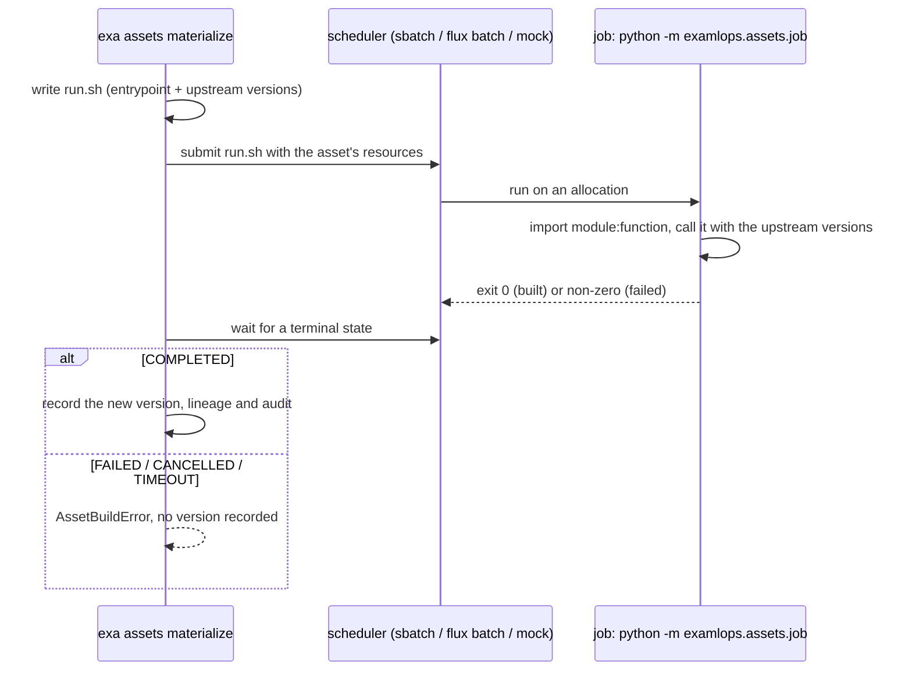

# Declarative Asset-Centric Pipelines (A4)

> Next-Gen 40 · feature **A4** · ADR 0036 · spec `design/vision/specs/A4-asset-centric-pipelines.md`

A4 adds an **asset-centric** layer over the existing task-centric Prefect orchestration.
Instead of thinking about *runs*, you declare the **things** the platform produces —
datasets (A1), features (A3), and models — as **assets** with upstream dependencies. The
platform then:

- builds the **asset DAG** (which coincides with the A2 lineage graph),
- tracks each asset's materialized version against **the upstream versions it was built
  from**, so it knows when an asset is **stale**, and
- rebuilds **only** a target asset plus its stale ancestors — selective, incremental
  materialization, not a full pipeline re-run.

The engine sits behind an `AssetOrchestrator` seam so it is swappable (a thin layer over
Prefect by default, or Dagster). The existing `exa pipeline run` path is **unchanged**.
Everything is pure Python and testable in-process — no Prefect or Dagster required to
declare assets, compute freshness, or materialize.

## Declaring assets

In code with the decorator:

```python
from examlops.assets import asset

@asset("jpcp_features", kind="feature", deps=["PM100"])
def build_jpcp_features(**upstream):
    ...  # upstream = {"PM100": <version>}

@asset("jpcp_model", kind="model", deps=["jpcp_features"])
def train_jpcp(**upstream):
    ...
```

Or from the CLI (source/dataset assets typically have no production function):

```bash
exa assets declare PM100 --kind dataset
exa assets declare jpcp_features --kind feature --deps PM100
exa assets declare jpcp_model --kind model --deps jpcp_features
exa assets graph
# PM100 (source)
# jpcp_features ← PM100
# jpcp_model ← jpcp_features
```

## What declares itself

You do not have to type the whole DAG in. **Recording a dataset revision advances that dataset's
asset automatically**, so the graph starts building itself from the platform's most common source
event:

```bash
exa data snapshot PM100 --backend minio --path ./data/PM100
exa assets status jpcp_model      # stale, because PM100 just moved
```

Every path that records a revision feeds it — the CLI, the synthetic-data generator and the Prefect
pipeline generator all call one function — so nothing has to know the asset layer exists.

Two behaviours worth knowing:

- **Only a genuinely new revision advances the version.** Re-recording the same revision is a no-op
  (the recorder is idempotent), because reporting a change that did not happen would make every
  downstream model stale for nothing, and a freshness signal that cries wolf is one nobody acts on.
- **It is best-effort.** The revision is the durable fact; the asset graph is a derived view of it.
  If the asset layer is unavailable the revision is still recorded.

**Applying a feature view declares it too**, with its source dataset upstream:

```python
apply_view(FeatureView(name="jpcp_features", entity="node", features=[...], source="PM100"))
```

```
PM100 → jpcp_features        # exa assets graph, with nothing typed in
```

Pipeline runs and model registrations do **not** yet declare themselves — those are still
`exa assets declare`. That is deliberate rather than pending: lineage events, the obvious source
for them, are revision- and version-scoped (`PM100@r1`, `jpcp/18`) because each records one
immutable run, while an asset is an entity with a current version. Deriving assets from them would
produce one throwaway node per revision that can never go stale or be materialized. The two
producers that exist are the ones whose call sites name an entity and its dependency directly.

## Freshness

An asset is **stale** when it was never materialized, when any declared upstream advanced
past the version this asset recorded at build time, or when any upstream is itself stale
(transitive):

```bash
exa assets status
# Asset          Version  State   Why
# PM100          1        fresh   —
# jpcp_features  1        fresh   —
# jpcp_model     1        fresh   —
```

## Selective materialization

`materialize` rebuilds the target and its stale ancestors only, dependencies-first:

```bash
exa assets materialize jpcp_model
# Materialized jpcp_model: rebuilt PM100, jpcp_features, jpcp_model   (first run)

exa assets materialize jpcp_model
# jpcp_model already fresh — nothing to rebuild.                       (all fresh)
```

When an upstream dataset revision lands (A1), mark the source changed; only the affected
downstream assets rebuild:

```bash
exa assets source-changed PM100
# PM100 advanced to v2 — downstream assets are now stale.

exa assets materialize jpcp_model
# Materialized jpcp_model: rebuilt jpcp_features, jpcp_model
#   skipped (fresh): PM100
```

This is the core win: a data change re-runs the *stale slice*, not the whole pipeline
(R4 / GWT-3).

## Where the work runs

Materialization goes through an `AssetOrchestrator`. Three ship:

| Orchestrator | What it does |
|---|---|
| `local` (**default**) | Calls the production function in this process. |
| `scheduler` | Runs the build as a job on the phase-23 HPC scheduler — mock, Slurm or Flux, whichever `EXAMLOPS_HPC_SCHEDULER` names — and waits for it. |
| `prefect` | Runs the build as a **Prefect flow run**, so it shows up in the Prefect UI with its state, duration and logs. |

```bash
exa assets materialize jpcp_model --orchestrator scheduler
export EXAMLOPS_ASSET_ORCHESTRATOR=scheduler     # or set it for every build
```

`local` stays the default deliberately: an asset layer that began submitting scheduler jobs on
upgrade would surprise every existing caller. An unrecognised value falls back to `local` too — a
typo should leave the asset built, not route it to an engine nobody configured.

### Prefect runs

```bash
export PREFECT_API_URL=http://localhost:14200/api     # the stack's Prefect server
exa assets materialize jpcp_model --orchestrator prefect
```

Each asset build is one flow run: flow `examlops-asset-materialize`, run name `asset:<name>`,
with the production function as its single task. The run executes **in the calling process**, so
nothing has to be deployed and no worker has to be running. It still gets Prefect's run record,
and a materialization called from inside a Prefect flow (a training pipeline, say) nests under it
as a subflow. The flow-run id is recorded on the version's lineage event
(`prefect_flow_run_id`), so a version leads back to the run that produced it.

| Variable | Default | Effect |
|---|---|---|
| `EXAMLOPS_ASSET_PREFECT_RETRIES` | `0` | Task retries for a failed production function |
| `EXAMLOPS_ASSET_PREFECT_RETRY_DELAY` | `10` | Seconds between those retries |

Retries are **opt-in**. A production function that failed halfway is not known to be safe to
repeat, so turn them on only for builds you know are idempotent.

**When Prefect is not there, the asset is still built, and the provenance says why.** That covers
no Prefect API configured, the `prefect` package missing, and a server that cannot be reached; in
each case the build runs locally and the lineage facet records `fallback: local (<reason>)`. What
decides it is whether the production function **started**:

- An error *before* it started belongs to Prefect, and the build falls back to local.
- An error *after* it started belongs to the asset, so it propagates exactly as it does under
  `local`, and no version is recorded.

Falling back in that second case would run a failing build twice and credit Prefect with a build
that did not happen.

With no `PREFECT_API_URL`, Prefect would normally start a temporary server of its own. The asset
layer declines that and builds locally, because a run recorded in a throwaway database under
`~/.prefect` is a run nobody can see.

### Scheduler jobs

`--orchestrator scheduler` runs the build as a job on the phase-23 scheduler (mock, Slurm or
Flux) and **waits for it**. That wait is what lets a selective rebuild stay correct: a downstream
asset is built only after its upstream job has finished.



The job runs **only the production function**. It never touches the asset graph, so it cannot
walk to other assets and submit more jobs, and it does not need to reach `platform.db`. The
process that submitted it records the single version bump.

**The production function must be importable** by the job, which means a module-level function.
The job imports it by `module:function`, and the name is resolved first and must give back the
very same object, so a wrapper borrowing another function's name is not sent. A closure or a
lambda cannot cross into another process; such a build runs locally and the lineage facet says so.

Ask for what the job needs through the asset's resources, which map onto sbatch / flux flags:

```python
@asset(kind="model", deps=["dataset:PM100"], resources={"gpus": 4, "time": "2:00:00"})
def jpcp_model(**upstream): ...
```

| Situation | Outcome |
|---|---|
| Job ends `COMPLETED` | Version recorded, with the scheduler job id on its lineage event |
| Job ends `FAILED`, `CANCELLED` or `TIMEOUT`, or is lost | `AssetBuildError` with the job's last log lines; **no version** |
| The scheduler refuses the job (bad account, full queue) | `AssetBuildError`. It is **not** run on this host instead, because a cluster-sized build quietly running on a login node would be the worse surprise |
| No scheduler in this environment | Built locally; the lineage facet records `fallback` |
| The production function is a closure or lambda | Built locally; the lineage facet records `fallback` |

The job is recorded in `hpc_jobs`, so `exa hpc jobs` lists asset builds (`model` = `asset:<name>`)
next to training runs.

**What the job's host needs:** the ExaMLOps package and the production function's code, reachable
by the job's python. The settings are the training pipeline's:

- `EXAMLOPS_HPC_REMOTE_PYTHON` names the interpreter.
- `EXAMLOPS_HPC_REMOTE_REPO` re-roots paths inside the repository on the cluster.
- `EXAMLOPS_HPC_REMOTE_WORKDIR` is where job directories go.

With none of them set, the job uses the submitting interpreter, which is right for the mock and
for a shared filesystem. The job gets its environment from the scheduler, which exports the
submitter's. No environment value is ever written into the script.

**The generated `run.sh`** is kept under `EXAMLOPS_ASSET_JOB_DIR`, by default
`$XDG_CACHE_HOME/examlops/asset-jobs`, as the exact record of what the job was asked to run. It is
mode 0700 with every value shell-quoted, and it is never written into the repository: it holds
this host's absolute paths.

## In the dashboard

**Build → Assets** (`/build/assets`) draws the asset DAG left to right: sources in the first
column, and each asset one column right of its deepest upstream. Every node prints its kind and
state (*fresh*, *stale*, *never built*, or *undeclared* for an upstream that is named but was never
declared). Select an asset to see **why** it is stale, what it is built from, and what it feeds. The
graph is also available as a data table for screen readers.

The view reads the same `asset_status` as `exa assets status`, so the two never disagree. It is
**read-only** on purpose. Materializing runs production code or submits scheduler jobs, which stays
with `exa assets materialize`, under policy and the scheduler, rather than being a web click.

API: `GET /api/assets` (the graph, freshness and counts) and `GET /api/assets/{name}`.

## Lineage, policy, audit

Every materialization:

- **emits OpenLineage** (A2) so the asset DAG coincides with the lineage graph (R6). With
  `EXAMLOPS_OPENLINEAGE_URL` set, events also push to Marquez; otherwise they land in
  `platform.db` (fail-open).
- **is policy-governed** (D5): a `deny` on the `asset_materialize` action blocks the run and
  records an `asset_materialize_denied` audit event. No policy file → default allow.
- **is audited** (D4): an `asset_materialize` event records what rebuilt and what was
  skipped.

## Backward compatibility

`exa pipeline run --model JPCP --dataset PM100Dataset` and every existing Prefect flow keep
working exactly as before (R2 / GWT-5). Assets are an additive layer you opt into.

## Related

- **A1** dataset revisions — a source-changed event models a new revision landing.
- **A2** OpenLineage — the asset DAG is the lineage graph.
- **A3** feature store — feature views are feature assets.
- **D4** audit / **D5** policy — every materialization is governed and audited.
