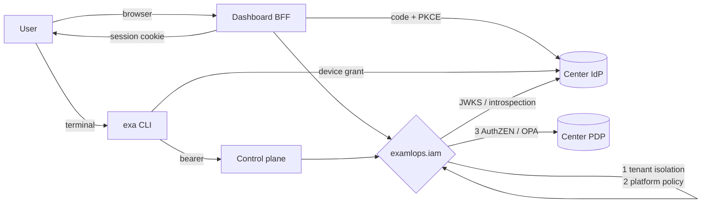

# Identity federation: sign in with your data center

ExaMLOps runs inside HPC/AI data centers that already know who their users are and what those users
may do. It does not add a second user store. It **federates**: it trusts the center's identity
provider (IdP), maps the groups and entitlements the center manages to platform roles, keeps every
center in its own tenant, and lets the center's own policy engine veto actions.

| Your center runs… | You configure… |
|---|---|
| An OIDC IdP: Keycloak, Unity (Helmholtz ID), EGI Check-in, MyAccessID, Entra/Okta | one **trust-file** entry |
| Only LDAP / Active Directory / Kerberos | the reference **Keycloak broker** in front of the directory, then one trust-file entry |
| Its own policy decision point: OPA, an OpenID AuthZEN service, OpenFGA | `authorization.mode: both` with the PDP's URL |
| Nothing (a laptop, a lab) | nothing: static tokens and local passwords keep working as before |

Design and rationale: ADR 0120. Standards followed: OAuth 2.0 Security BCP (RFC 9700), JWT access
tokens (RFC 9068) and JWT best practice (RFC 8725), browser apps via backend-for-frontend (RFC 10017),
PKCE (RFC 7636), authorization-server issuer identification (RFC 9207), device authorization
(RFC 8628), token introspection (RFC 7662), step-up authentication (RFC 9470), the OpenID AuthZEN
Authorization API 1.0, and AARC-G069 group entitlements.

## 1. How it fits together



Every enforcement point asks the same three questions, in order:

1. **Tenant isolation.** A user acts only inside the tenant their center is bound to. This is an
   invariant: no role and no external policy lifts it. A center's admin is not an admin of another
   center.
2. **Platform policy.** The role ladder `viewer < operator < admin`, raised by project-scoped roles
   and by relationship grants (`exa project add-member`).
3. **The center's policy** (optional). OpenID AuthZEN or OPA. The platform and the center must
   **both** allow (deny-overrides). A PDP that is down **denies**.

| Role | Can do |
|---|---|
| `viewer` | read everything in the tenant; run read-tier `exa` commands |
| `operator` | viewer, plus retrain, promote, approve/reject, drift baselines, traffic splits |
| `admin` | operator, plus secrets, configuration, service control, providers, gateway keys, CLI writes |

A user whose groups map to **no** role is *authenticated but not authorized*: they get a clear 403,
never a silent read-only view.

## 2. Write the trust file

Start from `platform/infra/iam/identity-providers.example.yaml`. The smallest useful entry:

```yaml
providers:
  - name: jsc                                   # prefixes every principal: jsc:<sub>
    display_name: "Jülich Supercomputing Centre"
    issuer: https://login.helmholtz.de/oauth2   # exact string; discovery must echo it
    audience: examlops                          # required: tokens for other apps are refused
    tenant: jsc                                 # default: the provider name
    role_rules:
      - {value: "urn:geant:helmholtz.de:group:examlops:admins", role: admin}
      - {value: "urn:geant:helmholtz.de:group:examlops:operators", role: operator}
    clients:
      dashboard: {client_id: examlops-dashboard, client_secret_ref: "env:JSC_DASHBOARD_CLIENT_SECRET"}
      cli: {client_id: exa-cli}
```

Set `EXAMLOPS_IAM_CONFIG` to its path on the **dashboard and the control plane**, then validate it:

```bash
exa auth validate --file identity-providers.yaml --check-discovery
exa auth providers
```

`validate` exits 1 on any error, so it works as a CI gate. The services re-read the file when it
changes, so adding a center needs no restart. **Removing** a center ends its users' dashboard
sessions immediately. An invalid file is refused as a whole: no federated token is accepted until
it is fixed, and `/health` on the control plane reports `identity_federation: fail: …`.

What the validator refuses, and why:

| Refused | Why |
|---|---|
| `algorithms: [HS256]` or `none` | a shared-secret or unsigned token could be minted by anyone holding the secret (RFC 8725) |
| a plain `http://` issuer (except loopback) | keys and tokens must travel over TLS |
| no `audience` | a token issued to any other application of the same center would be accepted |
| `tenant_claim` without `tenants_allowed` | a center could assert *another* center's tenant |
| unknown keys, roles or modes | a typo must not silently change policy |

### Mapping groups to roles

Rules are checked in order and the **strongest** matching role wins. A rule matches the raw claim
value or any normalized form of it:

| The center sends… | Rules can say… |
|---|---|
| Keycloak `groups: ["/examlops/admins"]` | `/examlops/admins`, `examlops/admins`, or `admins` |
| LDAP `cn=mlops-ops,ou=groups,dc=site,dc=eu` | the full DN, or `mlops-ops` |
| AARC-G069 `urn:geant:helmholtz.de:group:examlops:admins#login.helmholtz.de` | the URN with or without `#…`, or `examlops:admins` |
| an OAuth scope `examlops.operate` | (built in) `examlops.admin` / `examlops.operate` / `examlops.read` |

`match: glob` and `match: regex` are available. `claim:` pins a rule to one claim, and
`projects: [name]` grants the role on those projects only. `group_claims` lists where to look. The
default is `groups`, `roles`, `realm_access.roles`, `eduperson_entitlement` and `entitlements`.

To require identity assurance for powerful roles, add:

```yaml
    role_assurance:
      admin: ["https://refeds.org/assurance/IAP/medium"]
```

A user whose token lacks it is capped at the strongest role they *do* qualify for.

### Letting the center decide too

```yaml
    authorization:
      mode: both            # local | external | both (deny-overrides)
      pdp:
        type: authzen       # POST <url>/access/v1/evaluation
        url: https://pdp.example.org
        token_ref: "env:PDP_TOKEN"
        on_error: deny      # "local" = fall back to platform policy when the PDP is down
        cache_ttl_s: 30     # permits only
```

The PDP receives a standard AuthZEN request:

```json
{
  "subject":  {"type": "user", "id": "jsc:6f1c…", "properties": {"tenant": "jsc", "role": "operator",
               "groups": ["…"], "username": "alice", "acr": "https://refeds.org/profile/mfa"}},
  "action":   {"name": "model.promote"},
  "resource": {"type": "dashboard", "id": "/api/models/JPCP/versions/3/alias",
               "properties": {"method": "PUT", "tenant": "jsc"}},
  "context":  {"time": "2026-09-10T09:30:00+00:00"}
}
```

`action.name` is `api.read`/`api.write` on every route, and additionally the capability
(`model.promote`, `secret.reveal`, …) on governed dashboard actions. With `type: opa` the same
document is sent as `{"input": …}` to `/v1/data/<opa_path>`, and OPA may answer with a boolean or
with `{"allow": …, "reason": …}`. An undefined result is a deny. The example policy
`platform/infra/iam/opa/examlops.rego` implements a weekend change-freeze and a rule that promotion
requires MFA.

## 3. Register the clients at the center

Ask the center's IdP team for these clients (or create them in the reference Keycloak):

| Client | Type | Settings |
|---|---|---|
| `examlops-dashboard` | confidential | authorization code, PKCE S256, redirect `https://<dashboard>/api/auth/sso/callback`, audience `examlops` in access tokens, a `groups` (or entitlements) claim |
| `exa-cli` | public | **device authorization grant**, audience `examlops`, the same group claim, `offline_access` if refresh tokens are wanted |

Store the dashboard's client secret outside the trust file, as `env:NAME` on the dashboard or in the
platform secret store (`exa secrets set iam/jsc/dashboard …`, then `secret:iam/jsc/dashboard`).

## 4. Users: the dashboard

The login page shows **Sign in with <center>** for every provider that has a dashboard client. The
dashboard backend runs the authorization-code flow with PKCE, checks `state`, `nonce` and the RFC 9207
`iss` parameter, maps the roles, and keeps the session in an `HttpOnly; Secure; SameSite=Strict`
cookie. Neither the IdP's tokens nor the session token are ever visible to the page's JavaScript.
`GET /api/auth/me` shows `auth_method: sso`, the `idp`, the `tenant` and the capabilities.

Once SSO works, turn the shared passwords into an emergency path only:

```bash
DASHBOARD_LOCAL_LOGIN=false        # the password form disappears; /api/auth/login answers 403
```

Behind plain `http://<host>` (no TLS, not localhost), set `DASHBOARD_SESSION_COOKIE_SECURE=false`.
Otherwise browsers will not store the session cookie.

API clients can call the dashboard with a center access token directly:
`Authorization: Bearer <token>`.

## 5. Users: the CLI (and HPC login nodes)

```bash
exa auth login --provider jsc     # prints a URL + code; approve in any browser
exa auth whoami                   # your role, tenant and the rules that fired
exa retrain JPCP --dataset PM100Dataset   # now runs as you, audited as jsc:<you>
exa auth logout
```

The device flow needs no browser on the machine, so it works on a login node. The session is stored
per `exa config` context in `credentials.json` (mode 0600) next to the CLI config, and it is
refreshed automatically with rotation. A static `CONTROL_PLANE_TOKEN` still takes precedence where
one is configured. Sites that run **oidc-agent** can store nothing at all:

```bash
exa auth login --oidc-agent helmholtz     # each token minted by `oidc-token helmholtz`
```

For scripts: `curl -H "$(exa auth token --header)" …`.

## 6. Step-up for high-risk actions

Model promotion and secret reveal can require a recent, strong login (RFC 9470):

```yaml
    step_up:
      acr_values: ["https://refeds.org/profile/mfa"]
      max_age_s: 900
```

If the session doesn't meet that, the dashboard answers `401 insufficient_user_authentication`. The UI
sends the user back through the center's login with `prompt=login` and the required `acr`, then
returns them to the page. Enable it only for centers whose IdP can issue that `acr`. For local
password sessions, `EXAMLOPS_IAM_STEP_UP=enforce` requires a password login within
`EXAMLOPS_IAM_STEP_UP_MAX_AGE`.

## 7. Debugging a center's onboarding

```bash
exa auth token | exa auth verify --token-file -          # is it valid? which rules fired?
exa auth decide model.promote --resource-type model --resource-id JPCP   # full decision, incl. PDP
exa auth decide view --tenant cineca                      # → DENY [tenant]
```

Every deny is written to the audit chain as `authz_denied` (`exa audit --last 1d`), naming the
layer that denied (`tenant`, `local` or `pdp`) and the reason.

| Symptom | Likely cause |
|---|---|
| `issuer … is not a trusted identity provider` | the token's `iss` differs from the trust file, often by a trailing slash |
| `token verification failed: Invalid audience` | the IdP does not add `examlops` to `aud`; add an audience mapper |
| `…grants no ExaMLOps role` | no rule matched; `exa auth verify` lists the groups the token carries |
| `not trusted for tenant` | the tenant claim is outside `tenants_allowed` |
| `center PDP unavailable … fail closed` | the PDP URL or token is wrong, or the PDP is down |
| dashboard login loops back to the login page | `DASHBOARD_SESSION_COOKIE_SECURE` over plain HTTP, or the redirect URI is not registered |

## 8. A center with only LDAP: the reference broker

```bash
KC_BOOTSTRAP_ADMIN_PASSWORD=$(openssl rand -hex 16) \
  docker compose -f platform/infra/iam/docker-compose.iam.yml up -d
```

This starts Keycloak (`http://localhost:18180`, realm `examlops`, with both clients, the groups and
the mappers already configured) and OPA (`http://localhost:18181`, with the example policy). Connect
the directory in Keycloak under *User federation → LDAP* with edit mode `READ_ONLY`. ExaMLOps itself
never talks LDAP and never sees a password. This setup uses Keycloak's development mode; for
production, run Keycloak with TLS, a database and a fixed hostname.

To verify the whole chain against it, with a real Keycloak login form and real OPA decisions:

```bash
EXAMLOPS_IAM_LIVE_KEYCLOAK_ADMIN_PASSWORD=<the password above> \
  .venv/bin/pytest tests/integration/test_iam_keycloak_live.py -v
```

## 9. What is not covered yet

- **SCIM provisioning.** Deprovisioning happens at the IdP: disabling a user there stops new logins
  at once, and existing access tokens expire at their end-of-life (keep them short).
- **Acting as the user towards the control plane** from the dashboard and agents (RFC 8693 token
  exchange). Those calls still use a service credential and record the user in the audit event.
- **MCP over HTTP.** It remains loopback-only and unauthenticated. Put it behind an authenticated
  proxy if it must be exposed.

## Reference

- Trust file example: `platform/infra/iam/identity-providers.example.yaml`
- Environment variables: [env-vars § Identity federation](../reference/env-vars.md)
- Commands: [`exa auth`](../reference/cli-commands-guide.md)
- Code: `examlops.iam` (`config`, `tokens`, `claims`, `pdp`, `flows`, `session`, `stepup`), the
  dashboard `routers/sso.py` + `iam_gate.py`, and the control plane `_request_context`
