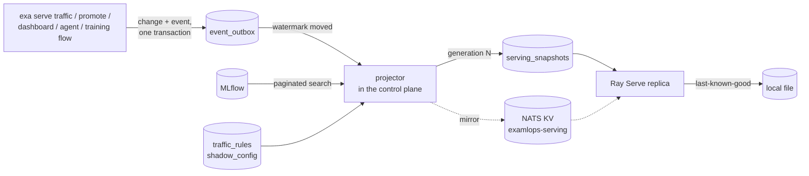

# Serving snapshot

Every serving replica needs the same facts: which version each model alias points to, the traffic
splits, and which models mirror to a shadow. The control plane compiles these once into a
**serving snapshot**. Replicas serve from that snapshot instead of each asking MLflow and the
platform database on a timer.

| | Before | With the snapshot |
|---|---|---|
| MLflow calls | every replica, every 60 s, one per model and alias | one compiler: a paginated search per recompile, one lookup per *new* version |
| Registries past 100 models | models after the first page were never served | every page is read |
| What a replica serves | whatever its last poll saw; replicas could disagree | a numbered **generation**, the same on every replica |
| A promotion reaches serving | within the 60 s poll (or the reload webhook) | within about 3 s (projector tick plus replica poll) |
| Control plane, database or MLflow down at replica start | the replica comes up empty | the replica serves its last-known-good snapshot |

## How it works



1. **Producing.** A traffic split, shadow change or alias move writes its event
   (`serving.traffic_changed`, `serving.shadow_changed`, `model.alias_changed`) to the outbox. The
   [event backbone](event-backbone.md) guide lists who emits what.
2. **Compiling.** The projector runs in the control plane, and only the replica holding the
   `control-plane:serving-snapshot` lease acts. It checks the outbox about once a second and
   recompiles when one of those topics has a new event. A full recompile also runs every
   `CONTROL_PLANE_SNAPSHOT_SECONDS` (60) regardless, which picks up an alias moved directly in the
   MLflow UI.
3. **Publishing.** A compile with new content becomes the next **generation**. The row, its
   `serving.snapshot_published` event and the pruning of old generations (the last 50 are kept)
   commit together. Unchanged content publishes nothing. With the NATS backbone, the snapshot is
   also mirrored to the key-value bucket `examlops-serving`.
4. **Serving.** Every `RAY_SNAPSHOT_POLL_SECONDS` (2), each replica takes the highest generation
   it can read from NATS KV or the database. It loads each model whose version moved **by
   version** (`models:/jpcp/7`), keeps every model that did not move, and unloads aliases the
   snapshot no longer has. Shadow targets and the inference router's traffic splits come from the
   snapshot too, so the request path reads no table. A poll costs one indexed `MAX(generation)`
   read; the body is fetched only when a new generation exists.

## Guarantees

- **Never a partial snapshot.** If MLflow cannot be read, the compile fails and the previous
  generation stays in force. A snapshot missing models would tell every replica to unload them.
  The projector retries with backoff (capped at a minute) rather than hammering MLflow.
- **A replica serves exactly what the snapshot says.** Models are loaded by version, not alias, so
  an alias that moves again mid-download cannot slip a different version in.
- **Integrity.** Every snapshot carries a SHA-256 digest of its content, and a replica refuses one
  whose digest does not match, whatever the source.
- **Last-known-good.** A load that fails keeps the version already being served. A replica that
  starts while NATS, the database and the control plane are all unreachable serves the snapshot it
  saved in `RAY_SNAPSHOT_CACHE`. That file is used *only* when no source answers: if the database is
  reachable and has no snapshot, an old file does not stand in for one.
- **Fallback.** With no snapshot published (projector disabled, or a fresh install before the first
  compile), replicas scan MLflow themselves exactly as before. `RAY_SNAPSHOT_MODE=off` forces that
  behaviour.

## Serving through an outage: the artifact cache

The snapshot tells a restarting replica *what* to serve. The **artifact cache**
(`RAY_ARTIFACT_CACHE`) lets it load *the bytes* without MLflow.

- Each version a replica loads is fetched once, by version (`models:/jpcp/7`), into
  `<cache>/<model>/<version>/`, with a manifest listing every file's SHA-256 and a digest of the
  whole tree. The download goes to a temporary directory and is moved into place atomically.
- On every later use the files are re-hashed against the manifest. A copy that has changed on
  disk is refetched, never loaded.
- With `EXAMLOPS_SERVING_VERIFY=warn|enforce`, signature verification runs against the cached
  bytes, and a copy that fails in `enforce` mode is deleted.
- Least-recently-used versions are evicted beyond `RAY_ARTIFACT_CACHE_MAX_GB` (20).
- Compose keeps the cache and the snapshot file on the `ray_serving_snapshot` volume, so both
  survive a container restart.

Together they make the serving plane statically stable (ADR 0123). A replica restarted while the
platform database, NATS, MLflow and the control plane are all down comes up serving the model it
served before, from its own disk. `tests/unit/test_serving_static_stability.py` shows it with a
real scikit-learn model and a real prediction, and a control run without the local state comes up
empty.

## Per-tenant quotas

The snapshot's `quotas` section holds per-tenant request limits the serving gateway enforces
(ADR 0123 decision 3). Set them where the control plane owns configuration:

```bash
exa gateway quota set acme 120       # 120 requests/min for tenant acme
exa gateway quota set batch 0        # unlimited for this tenant
exa gateway quota list
exa gateway quota remove acme        # back to EXAMLOPS_GATEWAY_TENANT_RPM
```

A change enqueues `serving.quota_changed`; the projector compiles a new generation and the gateway
picks it up within `EXAMLOPS_GATEWAY_QUOTA_REFRESH_SECONDS`. The gateway never reads the quota
table on the request path, refuses a snapshot that fails its digest, and keeps the last quotas it
read if the datastore goes away. A gateway that starts with the datastore down and has read no
snapshot enforces only the default. Snapshots published before this section existed still verify.

## Input schemas

Each aliased model version in the snapshot can carry `input_schema`: the column names and types (OIP
v2 datatypes) of its MLflow signature, and the feature count per row.

```json
{"kind": "columns", "inputs": [{"name": "cpu", "type": "FP64"}, {"name": "mem", "type": "FP64"}], "width": 2}
```

- **Where it comes from.** The `MLmodel` signature, read by the compiler through the MLflow
  tracking server (`/get-artifact`, or the logged-model route for `models:/m-<id>` sources). The
  use-case pack's model YAML is *not* used: the control-plane image does not contain the pack. A
  version's schema is read once and cached (versions are immutable). No signature means no
  `input_schema` key, so such a model hashes exactly as it did before schemas existed.
- **Artifact store down at compile time.** The schema the previous snapshot held for that same
  version is kept, and the alias moves still publish. It is not read as "no schema".
- **On the replica.** `/predict` checks the feature dict against the entry the request resolved to,
  and answers **422** naming the field: `missing features ['nodes']…`, `feature 'mem' must be a
  finite number (FP64), got 'fast'`, or a wrong value count for tensor models. Extra keys are ignored.
  `/v2/models/{name}/infer` validates tensor names and shapes against it, and
  `GET /v2/models/{name}` reports it. Nothing is read from a database on the way.
- **Fail open, deliberately.** A model with no schema, a schema the replica cannot interpret, or
  `RAY_INPUT_SCHEMA=off` is served by its own signature exactly as before. A schema is a
  convenience the platform adds, and a bug in it must not become an outage (ADR 0123 invariant 2).
  A schema that *is* present and verified is enforced (fail closed for that model).
- **Integrity.** It sits inside `models`, so the digest covers it. Snapshots without it (published
  before this) verify unchanged. A new version with a different schema is a new generation.
- **Limits.** Aliases outside `RAY_PRELOAD_ALIASES` and raw-version requests load lazily from
  MLflow and are not checked by the snapshot schema; OIP v2 schema errors keep status 400.

## Operating it

```bash
exa serve snapshot show              # current generation, digest, age, per-model alias versions
exa serve snapshot show --json       # the whole snapshot
exa serve snapshot publish           # compile now (audited); prints the generation
```

| Where | What it tells you |
|---|---|
| Control plane `/health` → `runtime.serving_snapshot` | leader, generation, seconds since the last good compile, last error |
| Ray Serve `/health` → `snapshot` | mode, the generation this replica serves, and where it came from (`kv`, `db`, `cache`) |
| `examlops_serving_snapshot_generation` | the newest generation the control plane published or confirmed |
| `ray_examlops_serving_snapshot_applied_generation{replica}` | the generation each replica serves |
| `examlops_serving_snapshot_compile_errors_total` | failed compiles |

Two alerts use these: **ServingSnapshotLagging** fires when a replica has been behind the
published generation for 5 minutes, and **ServingSnapshotCompileFailing** fires when compiles have
failed for 15 minutes.

## Configuration

| Variable | Default | Where |
|---|---|---|
| `CONTROL_PLANE_SNAPSHOT_SECONDS` | `60` | control plane — full recompile interval; `0` disables the projector |
| `CONTROL_PLANE_SNAPSHOT_TICK_SECONDS` | `1` | control plane — how often the outbox is checked |
| `EXAMLOPS_SNAPSHOT_MLFLOW_TIMEOUT` | `10` | control plane — seconds per MLflow call while compiling |
| `RAY_SNAPSHOT_MODE` | `auto` | replicas and the inference router — `off` keeps legacy MLflow polling and the router's table read |
| `RAY_SNAPSHOT_POLL_SECONDS` | `2` | replicas — how often a newer generation is looked for |
| `RAY_SNAPSHOT_CACHE` | a temp file (Compose: a volume) | replicas — the last-known-good copy |
| `RAY_ARTIFACT_CACHE` / `RAY_ARTIFACT_CACHE_MAX_GB` | off (Compose: a volume) / `20` | replicas — local content-addressed model versions |

## Not in this version

- Replicas poll for a new generation. They do not yet watch the KV bucket for a push.
- The snapshot does not yet carry each version's digest and signature. The artifact cache hashes
  what it downloads, and verification checks the signature store at load time. Carrying a
  registration-time digest in the snapshot needs artifacts signed at registration (plan P4.10).

## Related

- [Event backbone](event-backbone.md): the events that trigger a recompile
- [Control plane and serving plane](../architecture/control-and-serving-planes.md)
- [Ray Serve](../components/ray-serve.md)
