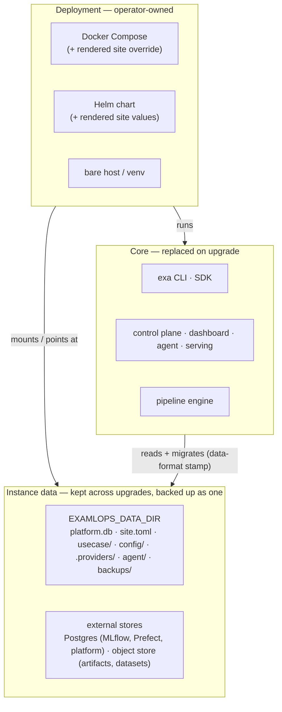

# Core · deployment · instance data

ExaMLOps is built as three layers. They change at different speeds and belong to different
people, so they are kept apart: a new release must be installable without touching anything a
user created, and one release must be deployable to Docker Compose or Kubernetes without a
different build.

| Layer | What it is | Who owns it | Changes when |
|---|---|---|---|
| **Core** | The product code: the `examlops` package and `exa` CLI, the pipeline engine, serving, and the control plane, dashboard and agent services | The ExaMLOps release | You install a new version. The whole layer is replaced. |
| **Deployment** | How the core runs: Docker Compose, the Helm chart, or a bare host. It holds endpoints, secrets, resource shapes and which services start. | The operator | You change the infrastructure or the set of services a centre runs |
| **Instance data** | Everything users create once the platform runs: models and their metadata, pipelines, projects, datasets, the audit chain, site configuration, the use-case pack, backups | The centre and its users | Every day. It must survive every upgrade. |



## The seams

Four small contracts connect the three layers. Each one is optional and backward compatible: if
none of them is set, an install behaves exactly as it did before they existed.

### 1. One data root (core ↔ instance data)

`EXAMLOPS_DATA_DIR` names the instance-data root. When it is set, every location of user data
defaults to a place inside it. An explicitly set per-store variable such as `PLATFORM_DB` still
wins.

| Path under the root | Holds |
|---|---|
| `platform.db` | The platform datastore on the SQLite engine: audit chain, projects, drift, lineage, costs, … |
| `site.toml` | The [site feature profile](site-feature-profiles.md): which modules this centre runs |
| `usecase/` | The site's own use-case pack: its models, pipelines and dataset bindings. It is used when it contains a `pack.toml`. |
| `config/` | Site configuration: `clusters.yaml`, `policy.yaml`, `finops.yaml`, `providers.yaml` |
| `.providers/` | Calculation providers authored from notebooks |
| `.feature_store/` | Feature-store files |
| `agent/` | The Skipper agent's checkpoints, long-term memory and memory-review queue (when `AGENT_DB` / `AGENT_MEMORY_DB` / `AGENT_MEMORY_REVIEW_DB` are unset) |
| `backups/` | Local backup bundles. Replicate these off-site. |

Data in external stores stays external: MLflow and Prefect metadata in Postgres, artifacts and
datasets in the object store, and, on Kubernetes, the platform datastore in Postgres. The
deployment points at those stores, and backup covers them through its `postgres` and `objects`
tiers.

```bash
exa instance init --data-dir /srv/examlops-data --pack usecases/seanergy --preset standard
export EXAMLOPS_DATA_DIR=/srv/examlops-data        # on every process
exa instance info                                   # every place user data lives
```

`exa instance info` lists every place the install keeps user data, not only the data root. For
each one it shows what set it, whether it exists, its size, and which backup tier captures it.

!!! note "Why the use-case pack moves out of the code tree"
    A pack kept inside the checkout is baked into images and replaced by the next release, which
    silently drops the models and pipelines users added. In `<data root>/usecase` the pack belongs
    to the site. Both pack loaders look there after `EXAMLOPS_USECASE_DIR` and before the bundled
    reference pack.

### 2. A data-format stamp (core ↔ instance data)

Every datastore carries a small stamp: an instance id, a data format, the lowest format that may
still read it, and the releases that created it and last opened it. Before a release opens the
data it compares that stamp with its own format. The outcome is one of: the data is current, it
is upgraded in place, it is opened as a rollback, or it is refused. See
[Upgrades & compatibility](upgrade-and-compatibility.md).

### 3. A site feature profile (instance data → core and deployment)

Which modules a centre runs is part of that centre's data. A profile in `site.toml`, optionally
overlaid by the `EXAMLOPS_FEATURES` environment variable, is enforced in several places:

- the CLI hides and refuses the disabled commands;
- the dashboard answers `404 module_disabled` on the routes of disabled modules;
- `exa modules render` turns the profile into Compose and Helm input.

See [Site feature profiles](site-feature-profiles.md).

### 4. A deployment contract (deployment → core)

Compose and Helm are two adapters that satisfy the same contract:

| The deployment provides | Compose | Helm |
|---|---|---|
| The core, as images or a venv | `docker-compose.yml` builds and pulls `examlops-*` images | Chart templates, `global.imageRegistry` |
| An instance-data root | `EXAMLOPS_DATA_DIR=/state`, the `${EXAMLOPS_STATE_DIR}` bind mount | External Postgres + object store (`EXAMLOPS_DB_BACKEND=postgres`) |
| The site profile | `EXAMLOPS_FEATURES` in the compose `.env`, `/state/site.toml`, and the rendered `docker-compose.site.yml` | `site.features` → ConfigMap `EXAMLOPS_FEATURES`; `agent.enabled` |
| Data upgrades before new code serves | Online migrations on first open, plus `exa upgrade apply` | The same, plus an optional `pre-upgrade` hook Job (`upgrade.hook.enabled`) |
| Its own identity | Detected (`container`) | `EXAMLOPS_DEPLOYMENT=kubernetes` |

## Installing a new release

The core is replaced and the instance data is carried forward:

```bash
exa backup create --all --push             # the undo, off-site
# install the new release: git pull / pip install / new image tag / helm upgrade
exa upgrade plan                           # the new release's verdict on the data
exa upgrade apply                          # backup + pending migrations (online ones also run by themselves)
exa instance check                         # compatibility, data root, profile, pack — exit 1 on a problem
```

On a source checkout the datastore stays at `<repo>/platform.db` unless a data root is set. On an
installed wheel it goes to `$XDG_DATA_HOME/examlops/platform.db`, so the data never ends up
inside the software that will be replaced.

## Related

- [Upgrades & compatibility](upgrade-and-compatibility.md)
- [Site feature profiles](site-feature-profiles.md)
- [Backup, restore & disaster recovery](backup-restore.md)
- [Enterprise installation & configuration](enterprise-installation.md)
- CLI: `exa instance`, `exa upgrade`, `exa modules` in the
  [command guide](../reference/cli-commands-guide.md)
