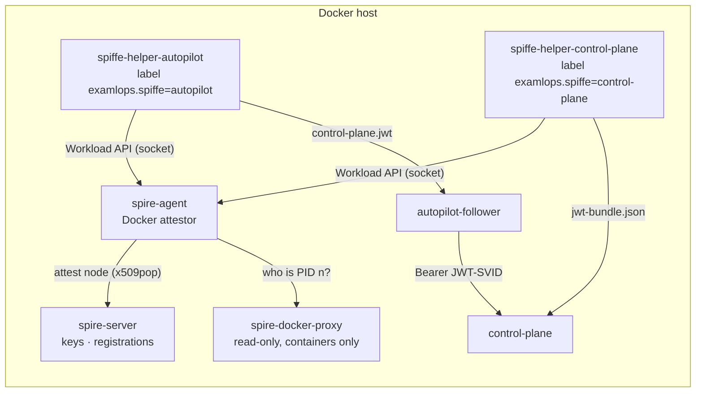
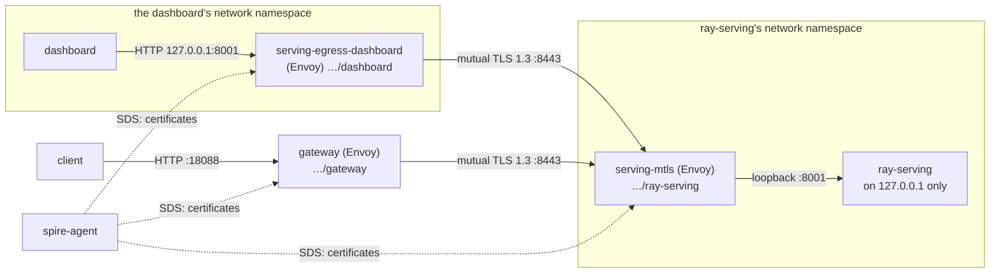

# Workload identity (SPIFFE and SPIRE)

Platform services call the control plane with a bearer credential. By default that credential is a
static secret: it lives until an operator changes it, and anyone holding a copy *is* that service.
With workload identity, each service instead proves who it is with a **JWT-SVID**. A JWT-SVID is a
token that [SPIRE](https://spiffe.io/docs/latest/spire-about/) issues to the running container,
for one audience, valid for five minutes, and renews on its own. A secret copied out of a
container is useless within minutes. Only a container that SPIRE recognises gets a token at all.

This guide covers turning it on with Docker Compose or on Kubernetes, running it, and moving each
service off its static secret. How the control plane verifies a token is in the component page:
[Workload identities (SPIFFE)](../components/control-plane.md#workload-identities-spiffe).

## How it fits together



1. **The SPIRE agent attests its node** to the server with a certificate from a local CA
   (`x509pop`). The certificate lets the agent re-attest after any restart, which a single-use
   join token cannot do. The agent trusts the server only through the server's CA, never by
   insecure bootstrap.
2. **A helper asks the agent for an identity.** The agent maps the helper's process to its
   container and reads the container's labels through a read-only Docker API proxy. A container
   labelled `examlops.spiffe=autopilot` matches the registration entry for
   `spiffe://examlops.internal/autopilot`.
3. **The helper writes the token** into a volume that only it and its service mount, and rewrites
   it at half the token's lifetime.
4. **The service sends the file's contents** as its bearer credential. It reads the file on every
   call through `CONTROL_PLANE_TOKEN_FILE`.
5. **The control plane verifies the token** against the trust bundle that its own helper keeps
   fresh (signature, algorithm, audience, expiry, trust domain). It then acts with the principal
   and scopes that SPIFFE ID is mapped to.

## Turn it on (Docker Compose)

From `platform/infra/docker-compose/`, add the overlay to the usual command:

```bash
docker compose -f docker-compose.yml -f docker-compose.identity.yml up -d
# with the event consumers and the bus bridge, as usual:
docker compose -f docker-compose.yml -f docker-compose.identity.yml \
    --profile events --profile seanerbus up -d
```

That starts:

| Service | What it does |
|---|---|
| `spire-pki` | One-shot. Creates the node CA and the agent's certificate, and renews the certificate within 30 days of expiry. Both private keys stay readable by root only. |
| `spire-server` | Issues identities. Its signing keys and registrations persist in the `spire_server_data` volume, so a restart keeps every issued token valid. |
| `spire-register` | One-shot. Exports the server's CA for the agent, and registers one entry per name in `SPIFFE_WORKLOADS`. It never changes an entry that already exists. |
| `spire-docker-proxy` | Read-only Docker API proxy for the agent: container inspection only, no `POST`, on a network only the agent joins. Inspection shows every container's environment, so no other service can reach it. |
| `spire-agent` | Attests callers by container label. It shares the host's PID namespace to map a caller's PID to its container. |
| `spiffe-helper-<service>` | One per service: keeps that service's token, or, for the control plane, the trust bundle. |

The SPIRE services are on two internal networks with no egress. Nothing publishes a port, and the
helpers have no network at all: they talk to the agent over its socket. Every upstream image is
pinned by digest.

**`spire-init`**, the one-shot setup image (openssl and SPIRE's command-line client; the SPIRE
images have no shell), is built from `identity/Dockerfile` in a checkout. Each release also
publishes it, signed and scanned, as `ghcr.io/mskazemi/examlops-spire-init:<version>`. To use the
published one rather than build it:

```bash
export EXAMLOPS_IMAGE_PREFIX=ghcr.io/mskazemi/examlops EXAMLOPS_IMAGE_TAG=<version>
docker compose -f docker-compose.yml -f docker-compose.identity.yml up -d --no-build
```

The same prefix and tag name every other platform image, so one setting moves the whole stack to
the release. The release scan passes it (no fixable CRITICAL). SPIRE's own `spire-server` binary
in it carries three HIGH findings (Go's `x/crypto` SSH package and gRPC), which are also in the
upstream SPIRE 1.15.3 image and go away with SPIRE's next release.

Nothing waits on SPIRE. Until a helper has written its file, the service sends its static
credential (`CONTROL_PLANE_TOKEN_FILE` falls back when the file is missing or empty). A SPIRE
outage therefore never stops the platform; it only delays the move to tokens.

### Who is who

| Service | SPIFFE ID | Principal | Scopes | Profile |
|---|---|---|---|---|
| dashboard | `spiffe://<trust domain>/dashboard` | `dashboard` | `read`, `write` | always |
| agent (Skipper) | `spiffe://<trust domain>/skipper` | `skipper` | `read`, `retrain` | always |
| autopilot-follower | `spiffe://<trust domain>/autopilot` | `autopilot` | `read`, `retrain` | `events` |
| seanerbus-bridge | `spiffe://<trust domain>/seanerbus-bridge` | `seanerbus-bridge` | `retrain` | `seanerbus` |
| control-plane | `spiffe://<trust domain>/control-plane` | — (receives; keeps the bundle) | — | always |

The principals and scopes are the ones each service's static credential has (see
[One credential per service](control-plane.md#one-credential-per-service-plan-p32)). Commands,
approvals and the audit trail therefore name the same service whichever credential it used.

### Settings

| Variable | Default | Purpose |
|---|---|---|
| `EXAMLOPS_SPIFFE_TRUST_DOMAIN` | `examlops.internal` | The installation's trust domain. SPIRE, the registrations and the control plane's mapping all follow it. |
| `SPIFFE_WORKLOADS` | `control-plane dashboard skipper autopilot seanerbus-bridge gateway ray-serving` | The names `spire-register` registers, each selected by the label `examlops.spiffe=<name>`. |
| `SPIFFE_JWT_SVID_TTL` | `300` | Token lifetime in seconds for newly registered workloads. |
| `SPIRE_SERVER_MEM_LIMIT` / `SPIRE_AGENT_MEM_LIMIT` | `256m` / `128m` | Memory ceilings. |
| `CONTROL_PLANE_WORKLOAD_IDENTITIES_JSON` | the table above | The control plane's SPIFFE ID → principal map. Compose cannot put JSON in a variable's default, so to change it, override the variable in a further `-f` file. |

### Every hop to the model server: mutual TLS

The overlay also makes every call to the model server mutual TLS 1.3 under the caller's own
identity, and closes the model server's plaintext port (ADR 0125 phases 2 and 3). Add the `gateway`
profile to include the serving gateway:

```bash
docker compose -f docker-compose.yml -f docker-compose.identity.yml --profile gateway up -d
```



The control plane, the agent and the SeanerBUS bridge are wired like the dashboard, each with its
own sidecar.

- **The model server listens on loopback only** (`RAY_SERVE_HOST=127.0.0.1`), and port 18001 is
  no longer published. Its own healthcheck and the inference pipeline inside it already use
  loopback. The Ray dashboard (18265, on the host's loopback) and Ray's metrics (18080, which
  Prometheus scrapes) are published as before.
- **`serving-mtls` is the one way in.** This Envoy runs in ray-serving's network namespace and
  listens on `ray-serving:8443`. It presents `…/ray-serving` and requires a client certificate from
  the trust domain's CA naming one of the model server's callers: `…/gateway`, `…/control-plane`,
  `…/dashboard`, `…/skipper` (the agent) or `…/seanerbus-bridge`. A workload with a valid identity
  that is not a caller, such as `…/autopilot`, is refused at the handshake. The Envoy tells the
  model server who called in `x-forwarded-client-cert`, replacing any value a client sent.
- **The admin routes need an admin caller.** `POST /reload`, `/reload/{model}` and
  `/infer-pipeline/traffic-rules/{model}` answer `403` unless the caller is the control plane, the
  dashboard or the agent. The gateway and the bridge only infer. The model server still checks its
  admin token (`RAY_SERVE_ADMIN_TOKEN`): the identity decides who may try, the token whether the
  request is authorised. Envoy makes the path canonical before the rule reads it (`//reload`,
  `/./reload` and `/RELOAD` are refused as well) and rejects an escaped slash (`/%2Freload`) with
  `400`. A unit test fails if the model server gains an admin route the rule does not cover.
- **The gateway speaks mutual TLS itself.** It runs `gateway/envoy-mtls.yaml`, which is
  `gateway/envoy.yaml` with one change: the upstream clusters (REST, and gRPC over HTTP/2) speak TLS
  1.3 to `ray-serving:8443`,
  presents the gateway's X.509-SVID, and accepts only a certificate naming `…/ray-serving`.
  Authentication, quotas, limits and routes are unchanged, and a unit test keeps the two files
  identical in everything else.
- **Every other caller gets an egress sidecar.** `serving-egress-<caller>` runs
  `identity/serving-egress-envoy.yaml` in the caller's network namespace and carries the caller's
  identity label. The caller's `RAY_SERVE_URL` is `http://127.0.0.1:8001`. It keeps speaking plain
  HTTP, now to its own loopback, and the sidecar carries the call to `ray-serving:8443` under the
  caller's identity, with the gateway's TLS settings (a unit test holds them identical). The caller
  needs no certificate code of its own. The sidecar runs under its caller's profile and is
  recreated with it.
- **Certificates come from the SPIRE agent** over Envoy's SDS on the Workload API socket, by
  container label. They rotate without a restart. SPIRE's SDS names `default` (this workload's
  certificate) and `ROOTCA` (the trust domain's CA) keep the trust domain out of every file. Each
  Envoy runs as Envoy's own user (uid 101) with a read-only root and no capabilities.

**What no longer reaches the model server directly** is everything outside these callers:

| Before | With the overlay |
|---|---|
| Inference from the host, notebooks or other tools on `:18001` | The serving gateway, `:18088`, with a virtual key (`exa gateway key issue`) |
| `exa serve batch`, `exa serve loadtest`, `exa predict`, `exa serve infer-check` on the host | The gateway: `exa config set ray_serve http://localhost:18088` and a `serving_token` (a virtual key), [from `exa`](serving-gateway.md#credentials) |
| `exa serve reload`, `exa serve traffic` (admin) on the host | The dashboard's [CLI console](dashboard-cli-console.md): it runs `exa` inside the dashboard, whose sidecar reaches the model server as an admin caller |
| A training run's reload webhook (`RAY_SERVE_RELOAD_URL`, or `RAY_SERVE_URL`) from the host's Prefect runner | The [serving snapshot](serving-snapshot.md) carries the promotion. The control plane recompiles it on the alias change, or within `CONTROL_PLANE_SNAPSHOT_SECONDS` (60) at the latest, and replicas follow a new snapshot within 2 s. While no snapshot exists, the model server's MLflow poll does (`RAY_RELOAD_POLL_SECONDS`, 60) |
| The dashboard's link to the model server's API docs (`PUBLIC_RAY_SERVE_URL`) | Not served |

**When a caller cannot reach the model server:**

| The caller gets | Cause | Do |
|---|---|---|
| Connection refused on `127.0.0.1:8001` | Its sidecar is not running | `docker compose logs serving-egress-<caller>` |
| `503` and `upstream connect error` | The TLS handshake failed: SPIRE has not issued the sidecar's certificate yet, or the identity is not one the model server accepts | Check the SPIRE agent's log and the caller's label |
| `403` and `RBAC: access denied` | An admin route from a caller that may not use it | Make the call from the control plane, the dashboard or the agent |

`tests/integration/test_serving_gateway_mtls_live.py` (`EXAMLOPS_SPIRE_LIVE=1`) runs the shipped
files against a real SPIRE and a stand-in model server that listens on loopback only. It starts
every Envoy with the user, read-only root and dropped capabilities the overlay gives it, and
checks that:

- a request crosses gateway, mTLS and sidecar, and the model server learns it came from
  `…/gateway`, while the gateway still refuses anonymous callers;
- at the TLS port, a client without a certificate is refused, and so is one with a valid
  `…/autopilot` certificate, while the gateway's and the dashboard's certificates get through;
- the dashboard, through its sidecar, can infer and reload, and the model server learns it was
  the dashboard;
- the bridge, through its sidecar, can infer, but every spelling of an admin route above is
  refused, and the gateway's identity is refused on `/reload` even straight at the TLS port;
- a sidecar carrying `…/autopilot` gets nothing through.

These runs found three defects. An Envoy upstream TLS context defaults its maximum to TLS 1.2, so
with only a 1.3 minimum no version remained (`NO_SUPPORTED_VERSIONS_ENABLED`); every file now pins
the minimum and the maximum. SDS needs a `node` block. And started as root without capabilities,
the Envoy image's entrypoint cannot hand its log output to the Envoy user and exits, which is why
every Envoy in the overlay runs as uid 101. The model server's loopback bind was checked separately
with the released ray-serving image: with `RAY_SERVE_HOST=127.0.0.1` its healthcheck passes and
another container cannot connect to port 8001; with the default it can.

## Turn it on (Kubernetes)

On Kubernetes, SPIRE is cluster infrastructure, like Postgres and NATS: a SPIRE server, a node agent
on every node, the SPIFFE CSI driver that hands pods the Workload API, and spire-controller-manager,
which turns `ClusterSPIFFEID` resources into registrations. Install them once with SPIRE's hardened
charts:

```bash
helm upgrade --install -n spire-mgmt --create-namespace spire-crds spire-crds \
  --repo https://spiffe.github.io/helm-charts-hardened/
helm upgrade --install -n spire-mgmt spire spire \
  --repo https://spiffe.github.io/helm-charts-hardened/ \
  --set global.spire.namespaces.create=true --set global.spire.trustDomain=example.org
```

Then turn it on in the ExaMLOps chart:

```yaml
workloadIdentity:
  enabled: true
  trustDomain: example.org        # the SPIRE server's
  clusterSPIFFEID:
    className: spire-mgmt-spire   # <SPIRE namespace>-<SPIRE release>; the default fits the install above
```

For each tier it deploys (the control plane, the dashboard, and the agent and autopilot follower
when enabled), the chart adds:

- **A `ClusterSPIFFEID`** that selects only that tier's pods, by the labels
  `app.kubernetes.io/{name,instance,component}` in the release namespace. It names them
  `spiffe://<trust domain>/ns/<namespace>/<release>-examlops/<tier>`, so two releases in one
  cluster never share an identity. It is not a `fallback`, so it takes precedence over SPIRE's
  default identity for the pod's service account.
- **A spiffe-helper sidecar** that reaches the Workload API through the CSI driver:
    - no hostPath and no privileges, running as the tier's own user with a read-only root;
    - it asks for the tier's own SVID by `hint`, so it never takes another identity the pod
      happens to match;
    - it keeps the token in a memory volume that the tier mounts read-only and reads through
      `CONTROL_PLANE_TOKEN_FILE`; the control plane's helper keeps the trust bundle instead.
- **The control plane's map** (`CONTROL_PLANE_WORKLOAD_IDENTITIES_JSON`), rendered from
  `workloadIdentity.callers` for exactly the tiers this release deploys. The same template names
  the IDs, so the two cannot disagree. The defaults are each tier's static-credential principal
  and scopes.

**The class name matters.** spire-controller-manager acts only on `ClusterSPIFFEID`s of its own
class and ignores the rest without an error: no status, no entry, and no token for any tier. The
hardened chart names the class `<its namespace>-<its release>`. If SPIRE is installed under
another name, set `clusterSPIFFEID.className` to match. `kubectl get clusterspiffeids` shows a
`status` only for the ones the controller manager accepted. With `clusterSPIFFEID.create: false`,
register the same IDs another way.

The render fails for `enabled` without a `trustDomain`. CI validates the rendered
`ClusterSPIFFEID`s with kubeconform against a strict schema generated from SPIRE's CRD, so a
misspelt field fails the build rather than being ignored by the cluster.

## Check that it works

```bash
C="docker compose -f docker-compose.yml -f docker-compose.identity.yml"
$C ps spire-server spire-agent            # both healthy
$C exec spire-server /opt/spire/bin/spire-server entry show \
    -socketPath /run/spire/server/private/api.sock   # the node alias + one entry per workload
curl -s localhost:18002/health | jq .startup_checks.workload_identity   # "ok"
```

On Kubernetes:

```bash
kubectl get clusterspiffeids            # each of the release's has a status: the class matched
kubectl -n <ns> logs deploy/<release>-examlops-dashboard -c spiffe-helper   # "JWT SVID updated"
```

Then watch the control plane's metrics. Every authenticated request is counted by principal and
by how it authenticated:

```promql
sum by (principal, method) (increase(control_plane_authentications_total[1h]))
```

`method` is `workload` for a JWT-SVID, `static` for a service's own secret, `legacy` for the
shared `CONTROL_PLANE_TOKEN`, and `federated` for a user's IdP token. The audit events the control
plane writes for retrains, approvals and cancellations record the same thing: `credential`, plus
`spiffe_id` when a workload acted. That includes a `/v1` retrain, which a worker dispatches later:
the submitter's credential is stored with the command, outside its idempotency hash, so a retry
with another credential of the same service is still the same command.

```bash
exa --json audit --last 1d | jq '.[] | select(.details.credential=="workload") | .details.spiffe_id'
```

## Move each service off its static secret

1. Turn on the overlay (above). Every service keeps its static secret as a fallback.
2. For each service, wait until
   `increase(control_plane_authentications_total{principal="<name>",method="static"}[1d])` stays 0
   while `method="workload"` grows. The service now authenticates with its token alone.
3. Remove that service's static secret: its entry in `CONTROL_PLANE_CREDENTIALS_JSON`, and its
   `<SERVICE>_CONTROL_PLANE_TOKEN` in `.env`.
4. When no service uses the shared token any more, retire it:
   `CONTROL_PLANE_LEGACY_TOKEN=warn`, then `off`
   ([how](../components/control-plane.md#retiring-the-shared-legacy-token)).

A service that has lost its fallback and cannot get a token is refused (403 or 401). Its helper's
log says why: `docker compose logs spiffe-helper-<name>`.

## Operating it

- **Key rotation needs no action.** SPIRE rotates its signing keys ahead of time and publishes the
  next key in the bundle before using it. The control plane's helper rewrites `jwt-bundle.json`,
  and the control plane re-reads the file when it changes.
- **Restarts are safe.** The server's keys and registrations are on disk. The agent re-attests
  with its node certificate. Helpers reconnect and carry on. The live test restarts both the
  server and the agent and checks that a token issued afterwards still verifies against the
  bundle fetched before.
- **Adding a workload.** Add its name to `SPIFFE_WORKLOADS` and add a helper with the label
  `examlops.spiffe=<name>` that writes into a volume the service mounts read-only. Point the
  service's `CONTROL_PLANE_TOKEN_FILE` at the file, and map the SPIFFE ID in
  `CONTROL_PLANE_WORKLOAD_IDENTITIES_JSON`. `tests/unit/test_compose_identity.py` fails if the
  label, the registration, the mapping, the volume or the profile disagree.
- **Changing an entry.** `spire-register` never changes an existing entry. Use
  `spire-server entry update` (or `entry delete`, then `up` again) inside `spire-server`.
- **Renewing the node certificate.** It lasts a year, and every `up` renews it within 30 days of
  expiry. Delete the `spire_pki` volume only to start over: every agent must then re-attest.

## Security model

- **The label is the identity.** On a Docker host, anyone who can start a container can give it
  any label, but anyone who can start containers already controls the host. The protection is
  against a secret leaking *out* of a container, where a token expires in minutes, and against
  processes that cannot start containers.
- **On Kubernetes, the namespace and labels are.** The node agent learns a pod's namespace and
  labels from the kubelet, not from the pod. Anyone allowed to create pods in the release namespace
  can create one with a tier's labels, so namespace RBAC is the boundary, as it already is for the
  tier's Secret.
- **What an attacker inside a service gets:** that service's current token, readable from its own
  volume, valid for at most five minutes, for the control plane's audience only, with that
  service's scopes. The service cannot write the file, and it cannot reach the Docker proxy or
  SPIRE's networks.
- **The Docker API is read-only and fenced.** The attestor inspects containers only; `POST` and
  every other API section are off. The proxy sits on an internal network only the agent joins.
- **The model server trusts callers, not the network.** Under the overlay it listens on loopback
  only. The one way in is the mutual-TLS port, which accepts five identities and lets three of them
  use the admin routes. Being on a Compose network gives no access at all.
- **Nothing trusts blindly.** The agent verifies the server against the server CA that
  `spire-register` exports, and the control plane accepts only asymmetric signatures from its own
  trust domain's keys. A bundle's keys for a federated trust domain never verify an SVID for this
  one.

## Verification

- `tests/unit/test_compose_identity.py` checks that the overlay's files agree: each caller reads
  the volume its labelled helper writes, read-only; each label is registered and mapped to the
  service's own principal and scopes; each helper runs under its service's profile; the helpers'
  files stay writable by the helper; SPIRE is isolated and pinned.
- `tests/unit/test_serving_gateway_mtls.py` checks the mutual-TLS files and wiring:
    - the gateway's mTLS config differs from the plain one only in its upstream hop;
    - every direct caller of the model server in the base stack has a sidecar under its own
      profile and identity, and the model server accepts exactly those identities and the gateway;
    - every admin route of the model server is behind the admin rule, and the path is canonical
      before the rule reads it;
    - the model server binds `RAY_SERVE_HOST` and the overlay no longer publishes 8001;
    - every Envoy runs as uid 101, read-only, without capabilities.
- `tests/integration/test_spire_compose_attestation_live.py` (`EXAMLOPS_SPIRE_LIVE=1`) brings up
  the shipped `identity/compose.yml` and checks that:
    - the labelled helper's token verifies, through `CONTROL_PLANE_TOKEN_FILE`, against the bundle
      the control plane's helper keeps;
    - a non-root user can read it;
    - a container without the label gets nothing;
    - a second `up` registers nothing twice;
    - tokens keep renewing across a server and agent restart.
- `tests/integration/test_workload_identity_spire_live.py` checks that the control plane acts on a
  real SPIRE token with the mapped scopes and refuses one issued for another audience.
- `tests/unit/test_helm_workload_identity.py` checks the chart:
    - one `ClusterSPIFFEID` per deployed tier, with the right selectors, class and hint;
    - the sidecar's hardening and CSI volume;
    - the callers' read-only token mounts;
    - the control plane's map, which covers exactly the deployed callers.
- `tests/integration/test_helm_workload_identity_kind_live.py` (`EXAMLOPS_KIND_SPIRE_LIVE=1`)
  installs SPIRE's hardened charts and this chart in a throwaway kind cluster, with a
  control-plane image built from the tree. It checks that:
    - the dashboard pod's sidecar gets a token naming the dashboard's SPIFFE ID;
    - the real control plane accepts it with only the scopes the chart mapped, and counts it as a
      `workload` authentication;
    - a pod of another release with the same labels gets no tier identity.

## Not yet

Only the control plane verifies JWT-SVIDs. Every hop to the model server, REST and gRPC, is mutual
TLS on Docker Compose; on Kubernetes the chart's gateway still reaches a model server it does not deploy over
plaintext. The other internal hops (to the control plane, MLflow, Postgres, NATS) still rely on
network segmentation and bearer credentials.
